# 🚀 KIOT FEST 2026: 2-Day Fullstack Web Development Workshop
> **Knowledge Institute of Technology (KIOT) — Department of Computer Science and Engineering**  
> *A comprehensive 2-Day hands-on workshop teaching modern JavaScript (ES6+), UI/UX Design Thinking, React 18, Redux Toolkit, Next.js, and Fullstack Web Engineering.*

---

## 📖 Table of Contents
1. [Workshop Overview & Philosophy](#-workshop-overview--philosophy)
2. [Syllabus & 2-Day Schedule](#-syllabus--2-day-schedule)
3. [The Problem-Driven Learning Matrix](#-the-problem-driven-learning-matrix)
4. [Git Branching Roadmap (18 Checkpoints)](#-git-branching-roadmap)
5. [Tech Stack & Architecture](#-tech-stack--architecture)
6. [Cross-Device & Cross-Browser Compatibility](#-cross-device--cross-browser-compatibility)
7. [Database Setup (MySQL + Dual-Mode Fallback)](#-database-setup)
8. [Getting Started (Run Locally)](#-getting-started)
9. [Deployment Guide (Vercel)](#-deployment-guide)

---

## 🎯 Workshop Overview & Philosophy
Students learn best when they **experience the real-world limitation or pain-point first**, and then see how the engineering concept elegantly resolves it. 

In this workshop, students build **KIOT Fest**—an enterprise-grade college symposium and hackathon management portal featuring:
- Live event directory with department filters (CSE, AI&DS, ECE, MECH, CIVIL, IT).
- Multi-event registration cart powered by **Redux Toolkit**.
- Dynamic QR code digital pass generation and print system.
- Fullstack API routes connected to **MySQL** (with safe in-memory fallback).
- Fluid typography (`clamp()`), responsive mobile drawers, and `@supports` glassmorphism fallbacks.

---

## 📅 Syllabus & 2-Day Schedule

```mermaid
gantt
    title 2-Day College Workshop Schedule (KIOT Fest)
    dateFormat  HH:mm
    axisFormat  %H:%M
    section Day 1: JS & React Foundations
    Unit 1 - JavaScript ES6+ & Async JS (Theory & Exercises)   :09:00, 11:00
    Tea Break & Interactive Quiz                                :11:00, 11:15
    Unit 2 - Design Thinking & Figma UI/UX                      :11:15, 13:00
    Lunch Break                                                 :13:00, 14:00
    Unit 3 - React Fundamentals (Problem -> Solution)           :14:00, 17:30
    section Day 2: Redux, Next.js & Deployment
    Unit 4 - State Management & Redux Toolkit Deep Dive         :09:00, 11:30
    Tea Break & Code Checkpoint                                 :11:30, 11:45
    Unit 5 - Next.js Fullstack, SSR/SSG & APIs                  :11:45, 13:15
    Lunch Break                                                 :13:15, 14:00
    Unit 5 - Cross-Device/Browser UI & MySQL DB                 :14:00, 15:30
    Unit 5 - SEO, Optimization & Vercel Deployment              :15:30, 16:30
    Mini-Project Showcase & Q&A                                 :16:30, 17:30
```



---

## 🧩 The Problem-Driven Learning Matrix

| Unit | Concept | Real-world Problem in KIOT Fest | Solution / Concept Introduced |
| :--- | :--- | :--- | :--- |
| **Unit 0** | **Why HTML?** | Raw text has no structure; browsers, screen readers & search engines can't parse content hierarchy. | Semantic HTML5 skeleton (`<header>`, `<nav>`, `<main>`, `<article>`, `<button>`, `<form>`). |
| **Unit 0** | **Why CSS?** | Raw HTML looks like 1991; unstyled tables, vertical stacking, and zero visual branding. | Native CSS (`style.css`) on the SAME HTML: Box Model, Grid/Flexbox, and the "Static Wall" limit. |
| **Unit 0** | **Why Vanilla JS?** | Styled page is a static poster; clicks do nothing. Need events, dynamic cart tally, and real-time filters. | Native DOM JavaScript (`script.js`) on the SAME HTML+CSS: Events, in-memory state & DOM Hell. |
| **Unit 0** | **Why React.js?** | Difficulties in Vanilla JS: Imperative DOM queries, manual state desync hell, monolithic HTML copy-paste. | Declarative Components (`<EventCard />`), reactive state (`useState`), and Virtual DOM diffing. |
| **Unit 0** | **Why Tailwind CSS?** | Difficulties in Native CSS: BEM naming fatigue, global specificity collisions, and dead CSS code bloat. | Utility-First Tailwind CSS: Design tokens (`p-6`, `bg-slate-900`), zero bloat, and colocated styling. |
| **Unit 0** | **Why Next.js?** | React SPAs send empty `<div id="root"></div>` (broken SEO & WhatsApp cards), slow 3G LCP, and no backend. | Next.js Server-Side Pre-rendering (SSR/SSG), file-system routing & unified Fullstack API routes. |
| **Unit 3** | **Components & JSX** | Hardcoding 20 event cards in a single 2000-line HTML file is unmaintainable. | Reusable `EventCard`, `Navbar`, `Footer` components. |
| **Unit 3** | **Props** | Every event card shows the same hardcoded "Web Hackathon" title and date. | Dynamic data passing via `props` (`title`, `department`, `prize`, `date`). |
| **Unit 3** | **useState** | Clicking "Register" or "Bookmark" button does not change the UI (props are immutable). | Component-level reactive state with `useState`. |
| **Unit 3** | **Conditional Rendering** | When search query has no match, page looks broken or blank; user sees "Register" even if seats are full. | Ternary & `&&` operators: Empty State (`"No events found"`), Sold Out badge. |
| **Unit 3** | **Forms & Controlled Components** | Event submission / student registration form reloads the whole page and loses data. | Synthetic Events (`e.preventDefault()`) & Controlled Input State. |
| **Unit 3** | **useEffect & API Fetching** | Fetching events inside component body causes an infinite loop of re-renders. | Lifecycle synchronization with `useEffect([], [deps])` + loading/error states. |
| **Unit 3** | **React Router** | Clicking "View Details" replaces the whole DOM or needs multiple HTML files, losing current filter state. | Single Page Application routing with `react-router-dom` (`Routes`, `Route`, `useParams`). |
| **Unit 4** | **Prop Drilling Problem** | Passing `cart` & `registeredEvents` from `App` down through 4 levels (`App` $\to$ `EventList` $\to$ `EventCard` $\to$ `RegisterButton`) and up to `Navbar`. | Identifying the need for Global State Management. |
| **Unit 4** | **useContext vs Redux** | Context causes re-renders of the entire tree when any single piece of state updates. | Redux Toolkit (RTK) with fine-grained selectors and predictable actions. |
| **Unit 4** | **RTK Store & Slices** | Cart count in `Navbar`, registration buttons in `EventCard`, and summary in `CartDrawer` get out of sync. | `cartSlice` with `addToCart`, `removeFromCart`, `clearCart`. |
| **Unit 4** | **Async State in Redux** | Network latency when loading fest events leads to unhandled error states. | `createAsyncThunk` in `eventSlice` (pending, fulfilled, rejected). |
| **Unit 4** | **State Persistence & DevTools** | Refreshing the page wipes out the student's selected fest registrations. | Redux DevTools inspection + LocalStorage state persistence. |
| **Unit 5** | **Next.js & File-based Routing** | React Router requires manual route config; client-side rendering sends an empty `<div id="root"></div>` hurting SEO and social sharing of fest events. | Next.js File-system Routing (`/events/[id]`, `/register`, `/my-tickets`). |
| **Unit 5** | **SSR vs SSG** | Static fest rules & schedule should load instantly (SSG), while live seat counter must be real-time (SSR). | `getStaticProps` / `getStaticPaths` vs `getServerSideProps`. |
| **Unit 5** | **API Routes & MySQL Integration** | Frontend needs a separate Express backend server, complicating setup for students. | Built-in Next.js `/api/events` and `/api/register` connecting to MySQL / Mock DB. |
| **Unit 5** | **Cross-Device & Cross-Browser Compatibility** | App looks broken on mobile phones (tiny text, horizontal scrolling, broken date pickers in Safari, broken backdrop blur in older browsers). | Fluid Typography (`clamp()`), Tailwind Responsive Breakpoints (`sm`, `md`, `lg`), Autoprefixer, Touch Targets ($>48\text{px}$), Fallback Glassmorphism. |
| **Unit 5** | **Image Optimization & SEO** | 5MB fest posters cause slow mobile 3G load; sharing event link on WhatsApp shows no image preview. | `next/image` (WebP/AVIF auto-compression) + `Head` OpenGraph tags & JSON-LD event schema. |
| **Unit 5** | **Vercel Deployment** | "It works on my localhost, but how do my college friends access it?" | 1-Click Vercel production deployment with Environment Variables. |

---

## 🌿 Git Branching Roadmap

Instructors and students can follow the live workshop step-by-step using these 25 checkpoint branches:

```text
main (Complete Fullstack Next.js + Redux + MySQL App)
├── preschool-01-why-html               (Unit 0: Raw Semantic HTML Structure & Limitations)
├── preschool-02-why-css                (Unit 0: Native CSS on the SAME HTML & The Static Wall)
├── preschool-03-why-vanilla-js         (Unit 0: Native DOM APIs on the SAME HTML & State Desync)
├── preschool-04-why-reactjs            (Unit 0: Declarative Components, useState & Virtual DOM)
├── preschool-05-native-css-to-tailwind (Unit 0: Utility Design Tokens & Solving Native CSS Bloat)
├── preschool-06-why-nextjs             (Unit 0: React SPA SEO & FCP Flaws vs Next.js SSR/SSG)
├── devsetup                            (Unit 1-2: Clean Developer Environment Starter Kit)
├── 01-react-setup-and-jsx              (Unit 3: Monolithic JSX Problem)
├── 02-components-and-props             (Unit 3: Reusable Components & Dynamic Props)
├── 03-state-and-event-handling         (Unit 3: Reactive State & Synthetic Events)
├── 04-conditional-rendering            (Unit 3: Empty States & Sold Out Badges)
├── 05-controlled-forms-validation      (Unit 3: Realtime Registration Validation)
├── 06-useeffect-and-api-integration    (Unit 3: Lifecycle Synchronization & Fetching)
├── 07-react-router-spa                 (Unit 3: Client-side Dynamic SPA Routing)
├── 08-prop-drilling-problem            (Unit 4: Deep Prop Passing Limitation)
├── 09-usecontext-and-limitations       (Unit 4: Context API & Re-render Overhead)
├── 10-redux-toolkit-store-and-cart-slice (Unit 4: Predictable Central Store & Reducers)
├── 11-redux-async-thunk-events         (Unit 4: Async Thunk Network State)
├── 12-redux-devtools-and-persistence   (Unit 4: LocalStorage Sync & Redux DevTools)
├── 13-nextjs-setup-file-routing        (Unit 5: File-system Routing & Document Head)
├── 14-nextjs-ssg-and-ssr               (Unit 5: Hybrid SSG & Dynamic SSR Rendering)
├── 15-nextjs-api-and-mysql             (Unit 5: Fullstack API Endpoints & MySQL Driver)
├── 16-cross-device-and-browser-compatibility (Unit 5: Fluid Typography & Mobile Drawer)
├── 17-image-optimization-and-seo       (Unit 5: WebP Compression & OpenGraph Meta)
└── 18-final-project-and-vercel-deploy  (Unit 5: Admin Auth, Pass Printing & Vercel Deploy)
```

To switch to any branch during the workshop:
```bash
git checkout preschool-01-why-html
```

---

## 📱 Cross-Device & Cross-Browser Compatibility

To ensure seamless operation on any student smartphone, iPad, MacBook, or Windows desktop across Chrome, Safari, Firefox, and Edge:

1. **Fluid Typography with `clamp()`**: Heading fonts scale smoothly without awkward line wraps:
   ```css
   .fluid-hero-title { font-size: clamp(2rem, 5vw + 0.5rem, 4rem); }
   ```
2. **Dynamic Viewport Height (`100dvh`)**: Avoids bottom navigation cutoff caused by mobile browser URL bars.
3. **Glassmorphism with `@supports`**: Graceful fallback to solid high-contrast dark surfaces for browsers without `backdrop-filter`.
4. **Touch Ergonomics**: All interactive touch targets are sized at least $\ge 48\text{px} \times 48\text{px}$.
5. **Mobile Virtual Keyboard Hints**: Forms use `inputMode="numeric"` for roll number and telephone fields.

---

## 🗄️ Database Setup (MySQL + Dual-Mode Fallback)

### Option A: Zero-Config In-Memory Mock Mode (Default)
If MySQL is not installed locally on a student's machine, the app **automatically operates in mock mode** with 8 pre-seeded events and working in-memory registration storage.

### Option B: Real MySQL Server Setup
1. Open MySQL terminal or phpMyAdmin:
   ```bash
   mysql -u root -p < database/schema.sql
   mysql -u root -p < database/seed.sql
   ```
2. Create `.env.local` in project root:
   ```env
   MYSQL_HOST=localhost
   MYSQL_USER=root
   MYSQL_PASSWORD=your_password
   MYSQL_DATABASE=kiot_fest_db
   MYSQL_PORT=3306
   ```

---

## 💻 Getting Started

### 1. Install Dependencies
```bash
npm install
```

### 2. Start Development Server
```bash
npm run dev
```
Open **http://localhost:3000** in your browser!

---

## ☁️ Deployment Guide (Vercel)

1. Push your repository to GitHub:
   ```bash
   git add .
   git commit -m "feat: complete KIOT Fest portal"
   git push origin main
   ```
2. Go to [vercel.com](https://vercel.com) $\to$ **Add New Project** $\to$ Import `kiot-fest-portal`.
3. Set environment variables (if using remote MySQL like PlanetScale / Railway / TiDB), or deploy with default mock fallback for instant zero-config live URL.
4. Click **Deploy** 🚀!

---

*Organized by Department of Computer Science & Engineering, Knowledge Institute of Technology.*
