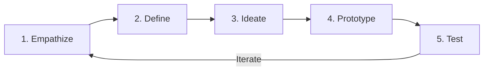

# Unit 2: Design Thinking & UI/UX Principles for KIOT Fest

## 1. What is Design Thinking?
Design Thinking is a **human-centered problem-solving methodology** that focuses on understanding user needs, challenging assumptions, and creating innovative solutions.

### Applying Design Thinking to KIOT Fest:
1. **Empathize (Understand the Student User)**:
   - *User Persona*: 3rd-year engineering student on a smartphone browsing events on mobile 4G.
   - *Pain Points*: "I don't know what events my department is conducting", "I don't know if registration is free or paid", "I lose my ticket confirmation SMS", "Forms with 20 fields take too long to fill on mobile".
2. **Define (Problem Statement)**:
   - *"Students need a fast, mobile-friendly college fest portal to discover departmental events, register in under 60 seconds, and view their downloadable QR fest pass anytime."*
3. **Ideate (Brainstorming Features)**:
   - Quick department filter pills (CSE, ECE, MECH, CIVIL, AI&DS).
   - Multi-event registration cart (Register for 3 events in one checkout).
   - Live seat count badge ("5 seats left" vs "Sold Out").
   - Digital QR Ticket Pass generator.
4. **Prototype (From Paper to Figma to Code)**:
   - Low-Fidelity wireframes (Paper/Whiteboard).
   - Mid-Fidelity wireframes (Grids and Layouts).
   - High-Fidelity interactive mockups in Figma with Tailwind design tokens.
5. **Test**:
   - Test with fellow classmates: Can they find the CSE Web Hackathon in under 5 seconds?

---

## 2. UI vs UX: Key Differences

| Dimension | User Interface (UI) | User Experience (UX) |
| :--- | :--- | :--- |
| **Focus** | Visuals, Typography, Colors, Spacing, Buttons, Glassmorphism. | Flow, Usability, Speed, Information Architecture, Satisfaction. |
| **Question Asked** | *"Does the KIOT Fest portal look modern and stunning?"* | *"Can the student easily register and find their pass without confusion?"* |
| **Tools** | Figma, Tailwind CSS, Color Palettes, Iconography. | User Journeys, Wireframes, Usability Testing, Analytics. |

---

## 3. Fundamental Principles of Good Design

1. **Visual Hierarchy**:
   - The most critical info (Fest Date, Event Title, Register CTA) must stand out first through font weight and color contrast.
2. **Consistency & Design Systems**:
   - All buttons, badges, and card borders should share consistent padding, radius (`rounded-xl`), and color tokens.
3. **Affordance & Feedback**:
   - Interactive elements must look clickable (hover lifts, active scales, cursor pointer, loading spinner on submit).
4. **Accessibility (a11y) & Color Contrast**:
   - Minimum 4.5:1 contrast ratio for body text.
   - Touch targets must be at least $48\text{px} \times 48\text{px}$ on mobile screens.
5. **Mobile-First Responsiveness**:
   - 80%+ college students access event links via WhatsApp on their smartphones; design for small screens first!
