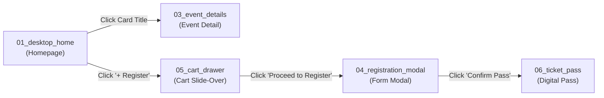

# 🎨 Unit 2: Complete KIOT Fest Figma App Blueprint & Import Guide

> **Target Audience:** 3rd-Year Computer Science & Engineering Students  
> **Topic:** Figma Prototyping, Design Systems, Vector Artboard Import, and Component Architecture  
> **Source App:** Mirrored 1:1 with the fullstack **KIOT Fest (Branch `18-final-project-and-vercel-deploy`)**

---

## 🚀 Part 1: How to Import the Vector Artboards into Figma (100% Free & Foolproof)

The complete UI of the production KIOT Fest portal is provided as **8 standalone high-fidelity vector artboard files** inside [`workshop_materials/unit2_design_thinking/artboards/`](file:///Users/apple/Downloads/dev/KIOT/react_nextjs/kiot_fest/workshop_materials/unit2_design_thinking/artboards).

Because Figma natively parses SVG files into editable vector frames, layers, text nodes, and color fills, you can import them into Figma in seconds with **zero plugins and zero setup**!

### 📥 Step-by-Step Import Instructions:

#### Method A: Direct Drag-and-Drop (Easiest — Works in Web & Desktop)
1. Open your browser and navigate to [figma.com](https://figma.com) (Log in with your college or personal Google account).
2. In the top right corner, click **"+ Design file"** to open a blank canvas.
3. Open your operating system's file manager (Finder on macOS or File Explorer on Windows):
   - Navigate to: `react_nextjs/kiot_fest/workshop_materials/unit2_design_thinking/artboards/`
4. Select all 8 `.svg` files (or drag them one by one):
   - `01_desktop_home.svg`
   - `02_mobile_home.svg`
   - `03_event_details.svg`
   - `04_registration_modal.svg`
   - `05_cart_drawer.svg`
   - `06_ticket_pass.svg`
   - `07_admin_dashboard.svg`
   - `08_design_system_components.svg`
5. Drag and drop them directly onto the blank Figma canvas!
6. **Watch Figma unpack the designs:**
   - Every card, button, text heading, badge, and gradient immediately becomes an **individual, editable Figma layer**!

#### Method B: Place Image/Vector Shortcut
1. Inside your open Figma document, press:
   - **macOS:** `Cmd + Shift + K`
   - **Windows:** `Ctrl + Shift + K`
2. Select the SVG files from `workshop_materials/unit2_design_thinking/artboards/`.
3. Click anywhere on the canvas to place each artboard.

---

## 🗺️ Part 2: The 8 Artboards in the Figma Kit

| Artboard File | Canvas Size | UI Elements Represented | React Component in Code |
| :--- | :--- | :--- | :--- |
| `01_desktop_home.svg` | $1440 \times 1024$ | Glassmorphism Navbar, Fest Hero with live countdown, search & department filter tabs, 2x2 Event Grid, Footer. | [`src/pages/index.js`](file:///Users/apple/Downloads/dev/KIOT/react_nextjs/kiot_fest/src/pages/index.js) |
| `02_mobile_home.svg` | $390 \times 844$ | iPhone 15 frame, mobile drawer trigger, fluid typography, horizontal category pills, stacked cards, bottom navigation. | Responsive mobile layout |
| `03_event_details.svg` | $1440 \times 960$ | Back navigation breadcrumb, flagship hero banner, competition schedule timeline, rules card, sticky registration card. | [`src/pages/events/[id].js`](file:///Users/apple/Downloads/dev/KIOT/react_nextjs/kiot_fest/src/pages/events/[id].js) |
| `04_registration_modal.svg` | $600 \times 680$ | Centered glassmorphism modal, Name/RollNo/Email/Phone inputs with green validation states, Cancel/Confirm actions. | [`src/components/RegistrationModal.jsx`](file:///Users/apple/Downloads/dev/KIOT/react_nextjs/kiot_fest/src/components/RegistrationModal.jsx) |
| `05_cart_drawer.svg` | $420 \times 844$ | Slide-over drawer, selected event item rows, trash removal buttons, fee summation, checkout trigger button. | [`src/components/CartDrawer.jsx`](file:///Users/apple/Downloads/dev/KIOT/react_nextjs/kiot_fest/src/components/CartDrawer.jsx) |
| `06_ticket_pass.svg` | $750 \times 520$ | Boarding pass layout, verified confirmed badge, attendee details grid, vector QR code with ticket code, security strip. | [`src/components/TicketPass.jsx`](file:///Users/apple/Downloads/dev/KIOT/react_nextjs/kiot_fest/src/components/TicketPass.jsx) |
| `07_admin_dashboard.svg` | $1440 \times 900$ | Event coordinator portal, publish new competition form, live roster list with booked seats progress bars. | [`src/pages/admin.js`](file:///Users/apple/Downloads/dev/KIOT/react_nextjs/kiot_fest/src/pages/admin.js) |
| `08_design_system_components.svg` | $1200 \times 880$ | Master Design System sheet: Color tokens, typography specimens, `EventCard` variants (`Default`, `In Cart`, `Sold Out`), Department badges. | Design System & Tokens |

---

## 🎨 Part 3: KIOT Fest Design Tokens Reference

All artboards use the exact design tokens defined in our Tailwind CSS configuration ([`tailwind.config.js`](file:///Users/apple/Downloads/dev/KIOT/react_nextjs/kiot_fest/tailwind.config.js)) and global stylesheet ([`src/styles/globals.css`](file:///Users/apple/Downloads/dev/KIOT/react_nextjs/kiot_fest/src/styles/globals.css)):

### 1. Color Palette Tokens:
- **Dark Surface Body:** `#0a0f1d` (Tailwind: `bg-[#0a0f1d]`)
- **Card Surface:** `#111827` (Tailwind: `bg-slate-900`)
- **Card Border:** `#1f2937` (Tailwind: `border-slate-800`)
- **Primary Brand Indigo:** `#6366f1` (Tailwind: `bg-indigo-600`)
- **Accent Purple/Violet:** `#a855f7` (Tailwind: `from-indigo-600 to-purple-600`)
- **Prize Amber Gold:** `#f59e0b` / `#fbbf24` (Tailwind: `text-amber-400`)
- **Success / Seats Available:** `#10b981` / `#6ee7b7` (Tailwind: `bg-emerald-500/20`)
- **Sold Out / Danger:** `#f43f5e` / `#f87171` (Tailwind: `bg-rose-500/20`)

### 2. Department Badge Color Styles:
- **CSE:** `#4338ca` fill with `#c7d2fe` text
- **ECE:** `#0e7490` fill with `#a5f3fc` text
- **AI&DS:** `#6b21a8` fill with `#e9d5ff` text
- **MECH:** `#78350f` fill with `#fde68a` text
- **CIVIL:** `#064e3b` fill with `#a7f3d0` text
- **IT:** `#881337` fill with `#fecdd3` text

### 3. Typography Styles:
- **Hero Headings:** Font Family: `Outfit`, Weight: `900` (Black), Sizes: $44\text{px}$ – $48\text{px}$, Letter Spacing: `-1px`.
- **Card Titles:** Font Family: `Outfit` or `Inter`, Weight: `800` (Bold), Size: $18\text{px}$.
- **Ticket Codes / Pass IDs:** Font Family: `SF Mono` or `Courier New`, Weight: `700`, Size: $12\text{px}$.

---

## ⚡ Part 4: Hands-On Figma Exercise: Auto-Layout & Component Variants (Click-by-Click Guide)

> [!TIP]
> **The Deep-Select Secret in Figma:** When you drag an SVG into Figma, everything is grouped. If clicking an object selects the whole page, hold **`Cmd` (Mac)** or **`Ctrl` (Windows)** and click directly on the element to deep-select it immediately!

---

### Exercise 2.1: Convert `EventCard` into a Master Component with 3 Variants

On artboard `08_design_system_components.svg`, we already placed the 3 card designs side-by-side:
- **Card 1:** Default (`+ Register`)
- **Card 2:** In Cart (`✓ In Cart` — Emerald)
- **Card 3:** Sold Out (`Closed` — Housefull)

#### Step 1: Group each card
1. Hold `Shift` and drag a marquee selection around **Card 1** (the Default card).
2. Press **`Cmd + G` (Mac)** or **`Ctrl + G` (Windows)** to group it into a single object. In the left layers panel, rename it to `Card - Default`.
3. Repeat for **Card 2** $\to$ Rename to `Card - In Cart`.
4. Repeat for **Card 3** $\to$ Rename to `Card - Sold Out`.

#### Step 2: Turn each into a Component
1. Select `Card - Default`.
2. Look at the top center toolbar in Figma. Click the **Create Component** icon (❖ 4 small diamonds), OR press **`Cmd + Option + K` (Mac)** / **`Ctrl + Alt + K` (Windows)**.
3. The bounding box turns purple.
4. Repeat for `Card - In Cart` and `Card - Sold Out`. You now have 3 individual components.

#### Step 3: Combine as Variants
1. Select all 3 purple components together by holding `Shift` and clicking each.
2. In the **Right Sidebar**, look for the button labeled: **`Combine as variants`** (dashed purple box with a plus sign).
3. Click it! Figma wraps all 3 cards in a dashed purple component set.

#### Step 4: Configure the Variant Property
1. In the Right Sidebar under **Variants**, double-click `Property 1` and rename it to **`State`**.
2. Click Card 1 inside the box $\to$ in the right panel set `State` to **`Default`**.
3. Click Card 2 inside the box $\to$ set `State` to **`In Cart`**.
4. Click Card 3 inside the box $\to$ set `State` to **`Sold Out`**.

#### Step 5: Test the Component
1. Copy Card 1 (`Cmd + C`) and paste it into `01_desktop_home.svg` (`Cmd + V`).
2. Notice the hollow diamond ($\diamond$) icon—it is an instance!
3. In the Right Sidebar, click the **`State`** dropdown and switch between `Default`, `In Cart`, and `Sold Out` to see the card transform instantly!

---

### Exercise 2.2: Apply Auto-Layout (`Shift + A`) to a Button

Auto-Layout is Figma's Flexbox engine. It ensures buttons grow or shrink dynamically based on text length:

1. Press `T` (Text Tool) and click on the canvas. Type: `+ Register`.
2. With the text layer selected, press **`Shift + A`**.
3. Look at the **Right Sidebar**:
   - **Auto-Layout Direction:** Horizontal (`→`).
   - **Horizontal padding (left/right):** Set to `20`.
   - **Vertical padding (top/bottom):** Set to `12`.
   - **Gap between items:** Set to `8`.
   - **Corner Radius:** Set to `12`.
   - **Fill:** Set color to `#6366f1` (KIOT Indigo).
   - **Text Color:** Set text fill to `#ffffff` (White, Bold).
4. Double-click the text and type a longer label like *"Register Now for Web Hackathon (₹200)"*.  
   *Notice how the button smoothly expands while preserving exact 20px padding!*

---

### Exercise 2.3: Build an Interactive Clickable Prototype

Switch from the **[ Design ]** tab to the **[ Prototype ]** tab in the top-right corner of Figma:

#### Interaction 1: Open Cart Drawer
1. On `01_desktop_home.svg`, hold `Cmd`/`Ctrl` and click the **`+ Register`** button on Card 2.
2. Hover over the button edge until a blue circle with `+` appears.
3. Drag the blue noodle to `05_cart_drawer.svg`.
4. In the Interaction Details panel:
   - **Trigger:** `On click`
   - **Action:** `Open overlay`
   - **Position:** `Top right` (or `Right side`)
   - **Animation:** `Slide in` $\to$ `← from right`
   - **Options:** Check `Close when clicking outside` and `Add background behind overlay (60%)`.

#### Interaction 2: Open Registration Modal
1. On `05_cart_drawer.svg`, select the bottom button: `Proceed to Register (2) →`.
2. Drag the blue noodle to `04_registration_modal.svg`.
3. In Interaction Details:
   - **Trigger:** `On click`
   - **Action:** `Open overlay`
   - **Position:** `Centered`
   - **Animation:** `Instant`
   - **Options:** Check `Add background behind overlay (70%)`.

#### Interaction 3: Confirm Pass & View QR Ticket
1. On `04_registration_modal.svg`, select `Confirm Pass (₹200) →`.
2. Drag the blue noodle to `06_ticket_pass.svg`.
3. In Interaction Details:
   - **Trigger:** `On click`
   - **Action:** `Navigate to`
   - **Animation:** `Smart animate` (`300ms`, `Ease out`).

#### Step 4: Run the Interactive Demo
In the top-right toolbar of Figma, click the **`▶` (Present / Play)** button (or press `Cmd + Option + Enter` / `Ctrl + Alt + Enter`).  
Click `+ Register` $\to$ Cart slides in $\to$ Click `Proceed to Register` $\to$ Modal pops up $\to$ Click `Confirm Pass` $\to$ Ticket animates into view! Enjoy your interactive student fest portal!
