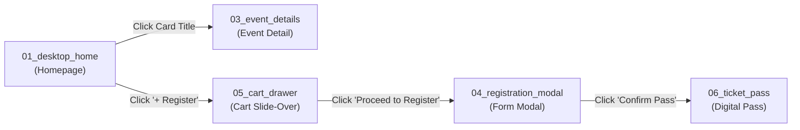

# 🎨 Unit 2: Complete KIOT Fest Figma App Blueprint & Import Guide

> **Target Audience:** 3rd-Year Computer Science & Engineering Students  
> **Topic:** Figma Prototyping, Design Systems, Vector Artboard Import, and Component Architecture  
> **Source App:** Mirrored 1:1 with the fullstack **KIOT Fest (Branch `18-final-project-and-vercel-deploy`)**

---

## 🚀 Part 1: How to Import the Vector Artboards into Figma (100% Free & Foolproof)

The complete UI of the production KIOT Fest portal is provided as **8 standalone high-fidelity vector artboard files** inside [`workshop_materials/unit2_design_thinking/artboards/`](file:///Users/apple/Downloads/dev/KIOT/react_nextjs/kiot_fest/workshop_materials/unit2_design_thinking/artboards).

Because Figma natively parses SVG files into editable vector frames, layers, text nodes, and color fills, you can import them into Figma in seconds with **zero plugins and zero setup**!

### 📥 Step-by-Step Import Instructions:

#### Method A: Direct Drag-and-Drop (Easiest — Works in Web & Desktop)
1. Open your browser and navigate to [figma.com](https://figma.com) (Log in with your college or personal Google account).
2. In the top right corner, click **"+ Design file"** to open a blank canvas.
3. Open your operating system's file manager (Finder on macOS or File Explorer on Windows):
   - Navigate to: `react_nextjs/kiot_fest/workshop_materials/unit2_design_thinking/artboards/`
4. Select all 8 `.svg` files (or drag them one by one):
   - `01_desktop_home.svg`
   - `02_mobile_home.svg`
   - `03_event_details.svg`
   - `04_registration_modal.svg`
   - `05_cart_drawer.svg`
   - `06_ticket_pass.svg`
   - `07_admin_dashboard.svg`
   - `08_design_system_components.svg`
5. Drag and drop them directly onto the blank Figma canvas!
6. **Watch Figma unpack the designs:**
   - Every card, button, text heading, badge, and gradient immediately becomes an **individual, editable Figma layer**!

#### Method B: Place Image/Vector Shortcut
1. Inside your open Figma document, press:
   - **macOS:** `Cmd + Shift + K`
   - **Windows:** `Ctrl + Shift + K`
2. Select the SVG files from `workshop_materials/unit2_design_thinking/artboards/`.
3. Click anywhere on the canvas to place each artboard.

---

## 🗺️ Part 2: The 8 Artboards in the Figma Kit

| Artboard File | Canvas Size | UI Elements Represented | React Component in Code |
| :--- | :--- | :--- | :--- |
| `01_desktop_home.svg` | $1440 \times 1024$ | Glassmorphism Navbar, Fest Hero with live countdown, search & department filter tabs, 2x2 Event Grid, Footer. | [`src/pages/index.js`](file:///Users/apple/Downloads/dev/KIOT/react_nextjs/kiot_fest/src/pages/index.js) |
| `02_mobile_home.svg` | $390 \times 844$ | iPhone 15 frame, mobile drawer trigger, fluid typography, horizontal category pills, stacked cards, bottom navigation. | Responsive mobile layout |
| `03_event_details.svg` | $1440 \times 960$ | Back navigation breadcrumb, flagship hero banner, competition schedule timeline, rules card, sticky registration card. | [`src/pages/events/[id].js`](file:///Users/apple/Downloads/dev/KIOT/react_nextjs/kiot_fest/src/pages/events/[id].js) |
| `04_registration_modal.svg` | $600 \times 680$ | Centered glassmorphism modal, Name/RollNo/Email/Phone inputs with green validation states, Cancel/Confirm actions. | [`src/components/RegistrationModal.jsx`](file:///Users/apple/Downloads/dev/KIOT/react_nextjs/kiot_fest/src/components/RegistrationModal.jsx) |
| `05_cart_drawer.svg` | $420 \times 844$ | Slide-over drawer, selected event item rows, trash removal buttons, fee summation, checkout trigger button. | [`src/components/CartDrawer.jsx`](file:///Users/apple/Downloads/dev/KIOT/react_nextjs/kiot_fest/src/components/CartDrawer.jsx) |
| `06_ticket_pass.svg` | $750 \times 520$ | Boarding pass layout, verified confirmed badge, attendee details grid, vector QR code with ticket code, security strip. | [`src/components/TicketPass.jsx`](file:///Users/apple/Downloads/dev/KIOT/react_nextjs/kiot_fest/src/components/TicketPass.jsx) |
| `07_admin_dashboard.svg` | $1440 \times 900$ | Event coordinator portal, publish new competition form, live roster list with booked seats progress bars. | [`src/pages/admin.js`](file:///Users/apple/Downloads/dev/KIOT/react_nextjs/kiot_fest/src/pages/admin.js) |
| `08_design_system_components.svg` | $1200 \times 880$ | Master Design System sheet: Color tokens, typography specimens, `EventCard` variants (`Default`, `In Cart`, `Sold Out`), Department badges. | Design System & Tokens |

---

## 🎨 Part 3: KIOT Fest Design Tokens Reference

All artboards use the exact design tokens defined in our Tailwind CSS configuration ([`tailwind.config.js`](file:///Users/apple/Downloads/dev/KIOT/react_nextjs/kiot_fest/tailwind.config.js)) and global stylesheet ([`src/styles/globals.css`](file:///Users/apple/Downloads/dev/KIOT/react_nextjs/kiot_fest/src/styles/globals.css)):

### 1. Color Palette Tokens:
- **Dark Surface Body:** `#0a0f1d` (Tailwind: `bg-[#0a0f1d]`)
- **Card Surface:** `#111827` (Tailwind: `bg-slate-900`)
- **Card Border:** `#1f2937` (Tailwind: `border-slate-800`)
- **Primary Brand Indigo:** `#6366f1` (Tailwind: `bg-indigo-600`)
- **Accent Purple/Violet:** `#a855f7` (Tailwind: `from-indigo-600 to-purple-600`)
- **Prize Amber Gold:** `#f59e0b` / `#fbbf24` (Tailwind: `text-amber-400`)
- **Success / Seats Available:** `#10b981` / `#6ee7b7` (Tailwind: `bg-emerald-500/20`)
- **Sold Out / Danger:** `#f43f5e` / `#f87171` (Tailwind: `bg-rose-500/20`)

### 2. Department Badge Color Styles:
- **CSE:** `#4338ca` fill with `#c7d2fe` text
- **ECE:** `#0e7490` fill with `#a5f3fc` text
- **AI&DS:** `#6b21a8` fill with `#e9d5ff` text
- **MECH:** `#78350f` fill with `#fde68a` text
- **CIVIL:** `#064e3b` fill with `#a7f3d0` text
- **IT:** `#881337` fill with `#fecdd3` text

### 3. Typography Styles:
- **Hero Headings:** Font Family: `Outfit`, Weight: `900` (Black), Sizes: $44\text{px}$ – $48\text{px}$, Letter Spacing: `-1px`.
- **Card Titles:** Font Family: `Outfit` or `Inter`, Weight: `800` (Bold), Size: $18\text{px}$.
- **Body & Subtitles:** Font Family: `Inter`, Weight: `400` / `500` (Regular), Sizes: $13\text{px}$ – $14\text{px}$.
- **Ticket Codes / Pass IDs:** Font Family: `SF Mono` or `Courier New`, Weight: `700`, Size: $12\text{px}$.

---

## ⚡ Part 4: Hands-On Figma Exercise: Auto-Layout & Component Variants

Once you have imported the artboards into Figma, complete these three essential professional UI/UX exercises:

### Exercise 2.1: Convert `EventCard` into a Master Component
1. On artboard `08_design_system_components.svg`, select the card labeled **`Variant: State = "Default"`**.
2. Press **`Cmd + Option + K`** (macOS) or **`Ctrl + Alt + K`** (Windows) to turn it into a **Master Component** (purple diamond icon).
3. In the right-hand Properties Panel, click **`+ Property` $\to$ `Variant`**.
4. Name the property: **`State`**.
5. Add two more variants:
   - Variant 2: Set `State` = **`In Cart`** (Change button to emerald *"✓ In Cart"*).
   - Variant 3: Set `State` = **`Sold Out`** (Change badge to *"🔴 HOUSEFULL"* and button to disabled *"Closed"*).
6. **Test the component:** Copy an instance of the card into your homepage, toggle the `State` dropdown in Figma, and observe how the card changes states instantly!

---

### Exercise 2.2: Apply Auto-Layout (`Shift + A`)
1. Select the button with text **`+ Register`**.
2. Press **`Shift + A`**.
3. In the Auto-Layout panel:
   - Direction: **Horizontal**.
   - Horizontal Padding: $20\text{px}$.
   - Vertical Padding: $10\text{px}$.
   - Corner Radius: $12\text{px}$.
4. Double-click the text and type a longer label like *"Register Now (Early Bird)"*.  
   *Notice how the button smoothly expands while preserving exact padding—just like CSS Flexbox!*

---

### Exercise 2.3: Build an Interactive Clickable Prototype
Switch to the **Prototype tab** (top right panel in Figma):

1. **Wiring the Cart Drawer:**
   - Select the `+ Register` button on Card 1.
   - Drag the blue prototyping noodle $\to$ to the `05_cart_drawer.svg` artboard.
   - Interaction: `On Click` $\to$ `Open Overlay` $\to$ Position: **Top Right**, Animation: **Slide In (from Right)**.
2. **Wiring the Registration Modal:**
   - On the cart drawer, select the *"Proceed to Register"* button.
   - Drag the noodle $\to$ to `04_registration_modal.svg`.
   - Interaction: `On Click` $\to$ `Open Overlay` $\to$ Position: **Centered**, Check: **Add background dim (60%)**.
3. **Wiring the Final Pass:**
   - In the modal, select *"Confirm Pass (₹200)"*.
   - Drag the noodle $\to$ to `06_ticket_pass.svg`.
   - Interaction: `On Click` $\to$ `Navigate To`, Animation: **Smart Animate**.
4. Click the **"Present" (▶ Play)** button in the top right of Figma to test your interactive student fest portal!
