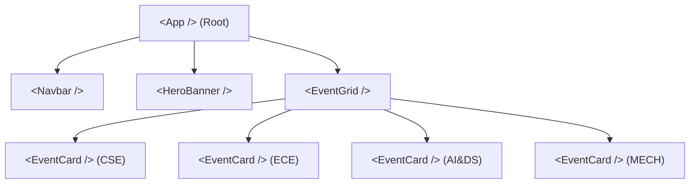
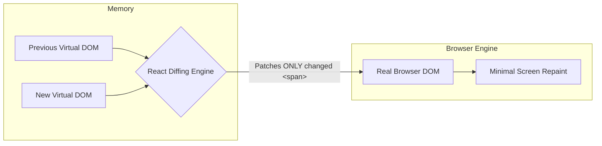

# ⚛️ Unit 3 — Step 1: Why React & The JSX Revolution

> **Git Branch:** `01-react-setup-and-jsx`  
> **Topic:** React Component Model, JSX Syntax Rules, and Virtual DOM Mechanics  
> **Pain Point:** Monolithic 2,000-line HTML/JSX files with endless copy-pasted cards.

---

## 🔴 The Pain Point: The Monolithic Copy-Paste Trap

In our initial setup (`01-react-setup-and-jsx`), open [`src/pages/index.js`](file:///Users/apple/Downloads/dev/KIOT/react_nextjs/kiot_fest/src/pages/index.js):

```jsx
// ❌ STEP 1: Monolithic JSX Copy-Pasting
export default function HomePage() {
  return (
    <div className="p-8 max-w-5xl mx-auto text-white">
      <h1 className="text-3xl font-black">KIOT FEST 2026</h1>

      {/* Hardcoded Event Card 1 */}
      <div className="p-6 bg-slate-900 border border-slate-800 rounded-2xl mb-4">
        <span className="text-xs font-bold px-2.5 py-1 bg-indigo-500/20 text-indigo-300">CSE</span>
        <h2 className="text-xl font-bold mt-2">Web Hackathon 2026</h2>
        <p className="text-sm text-slate-400">Build fullstack web applications using React in 6 hours.</p>
        <div className="mt-4 flex justify-between items-center">
          <span className="font-bold text-amber-300">Prize: ₹15,000</span>
          <button className="px-4 py-2 bg-indigo-600 rounded-xl text-white font-bold text-xs">Register (₹200)</button>
        </div>
      </div>

      {/* Hardcoded Event Card 2 (Exact Duplicate Structure!) */}
      <div className="p-6 bg-slate-900 border border-slate-800 rounded-2xl mb-4">
        <span className="text-xs font-bold px-2.5 py-1 bg-cyan-500/20 text-cyan-300">ECE</span>
        <h2 className="text-xl font-bold mt-2">Circuit Debugging Master</h2>
        <p className="text-sm text-slate-400">PCB and embedded microcontroller debugging challenge.</p>
        <div className="mt-4 flex justify-between items-center">
          <span className="font-bold text-amber-300">Prize: ₹8,000</span>
          <button className="px-4 py-2 bg-indigo-600 rounded-xl text-white font-bold text-xs">Register (₹100)</button>
        </div>
      </div>

      {/* ... Imagine repeating this 30 times for 30 college events! */}
    </div>
  );
}
```

### Why this is an engineering disaster:
1. **DRY (Don't Repeat Yourself) Violation:** If the fest committee asks to add an *"Event Venue"* badge to cards, you have to manually edit 30 different HTML blocks. Miss one, and the UI becomes inconsistent.
2. **Gigantic Bundle Size:** The file balloons to thousands of lines of duplicated markup.
3. **Zero Dynamic Capabilities:** Event data is welded directly into the presentation. We cannot filter, search, sort, or pull from an API.

---

## 💡 What is React?

React is a declarative, component-based JavaScript library developed by Meta for building user interfaces.

Rather than treating a webpage as one giant HTML document manipulated with imperative scripts (`document.getElementById`), React models the UI as a **tree of independent, composable components**:



Each component is a self-contained JavaScript function that returns what should appear on the screen.

---

## 🔍 Understanding JSX (JavaScript XML)

Look closely at the return statement of a React component:
```jsx
const element = <h1 className="title">Welcome to KIOT Fest</h1>;
```
This is **NOT** HTML, and it is **NOT** a string. It is **JSX**—a syntax extension for JavaScript.

### How JSX Works Under the Hood
Browsers cannot execute JSX directly. During build time, compilers like **Babel** or **SWC** (used by Vite and Next.js) transpile JSX into pure `React.createElement()` JavaScript calls:

```javascript
// What YOU write (JSX):
const element = <h1 className="title">Welcome to KIOT Fest</h1>;

// What the COMPILER produces (Pure JS):
const element = React.createElement(
  'h1',
  { className: 'title' },
  'Welcome to KIOT Fest'
);

// What React.createElement returns (A lightweight JS object):
{
  type: 'h1',
  props: {
    className: 'title',
    children: 'Welcome to KIOT Fest'
  }
}
```

This lightweight JavaScript object is a **Virtual DOM Node**.

---

## ⚖️ JSX vs HTML: The 6 Crucial Differences

Because JSX is transpiled into JavaScript, it must obey JavaScript language keywords and syntax constraints:

| Feature | Plain HTML | React JSX | Why the Difference? |
| :--- | :--- | :--- | :--- |
| **CSS Classes** | `<div class="card">` | `<div className="card">` | `class` is a reserved keyword in JavaScript for defining classes (`class Person {}`). |
| **Form Labels** | `<label for="email">` | `<label htmlFor="email">` | `for` is a reserved keyword in JavaScript for loops (`for (let i = 0; ...)`). |
| **Inline Styles** | `style="color: red; font-size: 14px;"` | `style={{ color: 'red', fontSize: '14px' }}` | Must be passed as a JavaScript object with camelCase property names. |
| **Closing Tags** | `` | `` | **Every tag must be closed**, including self-closing tags like `<input />`, `<br />`, `<hr />`. |
| **Single Root** | Can return multiple root tags | Must return **exactly one root element** | A JavaScript function cannot return two values without wrapping them (use `<>` Fragments). |
| **Attribute Names** | `onclick="handleClick()"` | `onClick={handleClick}` | HTML uses lowercase; JSX uses **camelCase** (`onChange`, `tabIndex`, `ariaLabel`). |

### 1. The Single Root Rule & React Fragments `<>`
In JavaScript, a function cannot return two objects simultaneously:
```jsx
// ❌ SYNTAX ERROR: Multiple root elements!
return (
  <h1>KIOT Fest 2026</h1>
  <p>Department of CSE</p>
);

// ✅ SOLUTION 1: Wrap in a parent div
return (
  <div>
    <h1>KIOT Fest 2026</h1>
    <p>Department of CSE</p>
  </div>
);

// ✅ SOLUTION 2: Use React Fragments (no extra DOM node created!)
return (
  <>
    <h1>KIOT Fest 2026</h1>
    <p>Department of CSE</p>
  </>
);
```

### 2. JavaScript Expression Interpolation `{}`
Inside JSX, you can embed any valid JavaScript expression by wrapping it in curly braces `{}`:

```jsx
export default function FestBanner() {
  const festYear = 2026;
  const collegeName = "Knowledge Institute of Technology";
  const isRegistrationOpen = true;

  return (
    <div className="banner">
      <h2>Welcome to {collegeName.toUpperCase()}</h2>
      <p>Edition: {festYear} (Next: {festYear + 1})</p>
      <span className="status">
        {isRegistrationOpen ? "🟢 Registrations Live" : "🔴 Registrations Closed"}
      </span>
    </div>
  );
}
```

> [!IMPORTANT]
> You can put any **JavaScript expression** inside `{}` (something that produces a value, like `a + b`, a function call, or a ternary `? :`). You **cannot** put JavaScript **statements** (like `if / else` or `for` loops) directly inside `{}`.

---

## ⚡ The Virtual DOM & Reconciliation

In `preschool-03-why-vanilla-js`, we saw that directly mutating the browser DOM is expensive because every change forces the browser to recalculate layouts (**Reflow**) and redraw pixels (**Repaint**).

### How React's Virtual DOM Works:
```
1. State or Props Change
       ↓
2. React renders a new Virtual DOM tree in memory (extremely fast pure JS objects)
       ↓
3. "Diffing Algorithm" compares New Virtual DOM with Previous Virtual DOM
       ↓
4. React calculates the minimal set of changes (Reconciliation)
       ↓
5. React batch-updates ONLY the changed elements in the real Browser DOM
```



---

## 🧪 Student Checkpoint & Exercises

### Exercise 1.1: Spot the 4 JSX Errors
Identify the four syntax errors in this snippet and rewrite it correctly:
```jsx
export default function EventBadge() {
  return (
    <div class="badge-box">
      <h3 style="color: yellow; margin-top: 10px;">Flagship Event</h3>
      <input type="text" placeholder="Enter coupon code">
      <label for="coupon">Coupon Code</label>
    </div>
  )
}
```

<details>
<summary>👀 Click to view Solution</summary>

```jsx
export default function EventBadge() {
  return (
    <div className="badge-box"> {/* Error 1: class -> className */}
      {/* Error 2: style must be a JS object with camelCase keys */}
      <h3 style={{ color: 'yellow', marginTop: '10px' }}>Flagship Event</h3>
      {/* Error 3: input tag must be self-closing */}
      <input type="text" placeholder="Enter coupon code" />
      {/* Error 4: for -> htmlFor */}
      <label htmlFor="coupon">Coupon Code</label>
    </div>
  );
}
```
</details>

---

## ⏭️ Next Step: Solving the Duplication
Now that we understand JSX, we are ready to solve the monolithic copy-pasting of cards.  
Proceed to **[Unit 3 — Step 2: Components & Props](./02-components-and-props.md)**!
