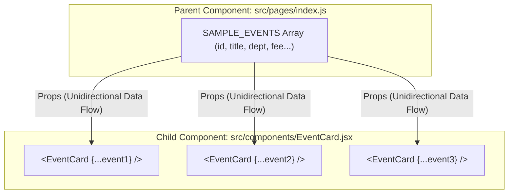

# ⚛️ Unit 3 — Step 2: Components & Props

> **Git Branch:** `02-components-and-props`  
> **Topic:** Component Decomposition, Dynamic Props Passing, List Rendering, and the `key` Prop  
> **Pain Point:** Hardcoded card data cannot scale; any design change requires manual edits across dozens of markup blocks.

---

## 🔴 The Pain Point: Hardcoded Content Cannot Scale

In Step 1, every card was hardcoded into `index.js`. If the fest organizers have 40 competitions across CSE, ECE, AI&DS, and MECH:
- Modifying card layouts requires updating 40 identical blocks.
- We cannot plug in an API or JSON data source.
- Our page component is cluttered with presentation details.

---

## 🧩 Solution Part 1: Component Extraction

A React **Component** is a reusable, self-contained piece of UI. Just like functions in JavaScript allow you to reuse logic, components allow you to reuse markup and styling.

Let's extract the duplicated card structure into a standalone file: [`src/components/EventCard.jsx`](file:///Users/apple/Downloads/dev/KIOT/react_nextjs/kiot_fest/src/components/EventCard.jsx).



---

## 📥 What are Props?

**Props** (short for *properties*) are the mechanism for passing data down from a **parent component** to a **child component**.

Think of a React component like an ordinary JavaScript function:
- **HTML tags** are the return value.
- **Props** are the function arguments.

```
function sum(a, b)           -->   function EventCard(props)
return a + b;                -->   return <div>{props.title}</div>
```

### 1. Passing Props in the Parent (`src/pages/index.js`)
```jsx
import EventCard from '../components/EventCard';

export default function HomePage() {
  return (
    <div className="grid grid-cols-2 gap-6">
      <EventCard 
        title="Web Hackathon 2026"
        department="CSE"
        description="Build innovative web apps."
        prize="₹15,000"
        fee={200}
        date="March 25"
      />
    </div>
  );
}
```

> [!TIP]
> Strings can be passed with quotes: `title="Web Hackathon"`.  
> Numbers, booleans, arrays, objects, and functions must be wrapped in curly braces: `fee={200}` or `isFlagship={true}`.

---

## ✂️ Prop Destructuring: Clean vs Verbose

In JavaScript ES6, we can unpack properties directly from the argument object:

### Verbose Approach (Using the raw `props` object):
```jsx
// ❌ Verbose: repeating "props." everywhere
export default function EventCard(props) {
  return (
    <div className="card">
      <span>{props.department}</span>
      <h3>{props.title}</h3>
      <p>{props.description}</p>
      <span>Fee: ₹{props.fee}</span>
    </div>
  );
}
```

### Clean Modern Approach (ES6 Destructuring):
```jsx
// ✅ Clean: destructure directly in the parameter signature
export default function EventCard({ title, department, description, prize, fee, date }) {
  return (
    <div className="p-6 bg-slate-900 border border-slate-800 rounded-2xl flex flex-col justify-between">
      <div>
        <span className="text-xs font-bold px-2.5 py-1 rounded bg-indigo-500/20 text-indigo-300">
          {department}
        </span>
        <h3 className="text-xl font-bold text-white mt-2">{title}</h3>
        <p className="text-sm text-slate-400 mt-1">{description}</p>
        <p className="text-xs text-slate-500 mt-2">📅 {date}</p>
      </div>

      <div className="mt-4 pt-4 border-t border-slate-800 flex justify-between items-center">
        <span className="font-bold text-amber-400">Prize: {prize}</span>
        <button 
          onClick={() => alert("Props are read-only! We need useState to make this reactive.")}
          className="px-4 py-2 bg-indigo-600 hover:bg-indigo-500 text-white rounded-xl text-xs font-bold transition"
        >
          Register (₹{fee})
        </button>
      </div>
    </div>
  );
}
```

---

## 🔄 Dynamic List Rendering with `map()`

Instead of manually typing `<EventCard />` multiple times, we store event objects in an array and transform them into JSX using the JavaScript array `map()` method:

```jsx
const SAMPLE_EVENTS = [
  { id: 1, title: 'Web Hackathon 2026', department: 'CSE', description: 'Build innovative web apps.', prize: '₹15,000', fee: 200, date: 'March 25' },
  { id: 2, title: 'Circuit Debugging', department: 'ECE', description: 'Embedded PCB debugging.', prize: '₹8,000', fee: 100, date: 'March 25' },
  { id: 3, title: 'GenAI Masterclass', department: 'AI&DS', description: 'Hands-on LLM workshop.', prize: 'Certificates', fee: 350, date: 'March 26' },
  { id: 4, title: 'Robo Wars', department: 'MECH', description: 'Combat robotics battle.', prize: '₹25,000', fee: 300, date: 'March 26' }
];

export default function HomePage() {
  return (
    <div className="grid grid-cols-1 md:grid-cols-2 gap-6">
      {SAMPLE_EVENTS.map((event) => (
        <EventCard
          key={event.id}
          title={event.title}
          department={event.department}
          description={event.description}
          prize={event.prize}
          fee={event.fee}
          date={event.date}
        />
      ))}
    </div>
  );
}
```

### ⚡ Shortcut: Object Spread Syntax
When the prop names in your component match the property keys of your data object, you can use the ES6 object spread operator:
```jsx
// This spreads every key of 'event' as an individual prop:
{SAMPLE_EVENTS.map(event => (
  <EventCard key={event.id} {...event} />
))}
```

---

## 🔑 The Golden Rule: The `key` Prop

Notice `key={event.id}` in the `.map()` loop above. If you omit this, React displays a prominent console warning:
> `Warning: Each child in a list should have a unique "key" prop.`

### Why is `key` required?
React's Virtual DOM uses the `key` to identify which items have changed, been added, or been removed between renders.

```
Without unique keys:
If item #1 is deleted from a list of 100 items, React cannot tell which one was removed.
It re-renders and re-creates all 100 DOM elements!

With unique keys (e.g. key={event.id}):
React immediately spots that only node '1' disappeared, and leaves the remaining 99 DOM nodes completely untouched!
```

> [!CAUTION]
> **Never use the array index as a key** (`key={index}`) if the list can be filtered, re-ordered, or deleted! Using array indices as keys causes subtle UI bugs with inputs and animations. Always use unique, stable IDs from your data (e.g. `event.id`).

---

## 🛡️ Props are Strictly Read-Only (Immutable)

A fundamental principle of React is **Unidirectional Data Flow** (data flows strictly downward from Parent to Child):

```
Parent (HomePage)  ──[passes props]──▶  Child (EventCard)
```

A child component must **NEVER** modify its incoming props directly:
```jsx
// ❌ FATAL ERROR: Props are read-only!
export default function EventCard({ fee }) {
  function applyDiscount() {
    fee = fee - 50; // TypeError: Cannot assign to read-only property!
  }
}
```

---

## 🔴 The Pain Point Leading to Step 3

In [`src/components/EventCard.jsx`](file:///Users/apple/Downloads/dev/KIOT/react_nextjs/kiot_fest/src/components/EventCard.jsx), click the **"Register"** button:
```jsx
<button 
  onClick={() => alert("Props are read-only! We need useState to make this reactive.")}
>
  Register (₹{fee})
</button>
```
An alert pops up! We want:
1. An interactive live registration counter in our header (`Registered: 3`).
2. A search box to filter events live as the user types.

Because props cannot change from inside the component, how can a React component remember and update its own data?

---

## ⏭️ Next Step: Making the UI Reactive
Proceed to **[Unit 3 — Step 3: useState & Synthetic Events](./03-usestate-and-synthetic-events.md)** to add real-time interactivity!
