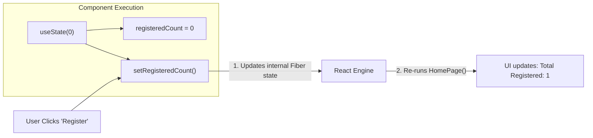

# ⚛️ Unit 3 — Step 3: useState & Synthetic Events

> **Git Branch:** `03-state-and-event-handling`  
> **Topic:** React State Hook (`useState`), Component Memory, Synthetic Event System, and Derived State  
> **Pain Point:** Regular JavaScript variables do not trigger UI re-renders; user interactions leave the screen static.

---

## 🔴 The Pain Point: Why Ordinary JavaScript Variables Fail in React

Let's attempt to add an event registration counter using standard JavaScript variables:

```jsx
// ❌ BROKEN: Ordinary variable does NOT trigger a re-render!
export default function HomePage() {
  let registeredCount = 0;

  function handleRegister() {
    registeredCount++;
    console.log("Count is now:", registeredCount); // Logs: 1, 2, 3...
  }

  return (
    <div>
      <span>Total Registered: {registeredCount}</span> {/* Stays 0 on screen forever! */}
      <button onClick={handleRegister}>Register</button>
    </div>
  );
}
```

### Why didn't the UI update?
1. **Local variables don't survive re-renders:** Every time a function component executes, its local variables are reset to their initial values.
2. **React doesn't watch local variables:** Changing `registeredCount++` doesn't notify React that the UI needs to be updated. React has no idea anything changed!

To solve this, React gives components **State** through the **`useState`** Hook.

---

## 💡 The `useState` Hook: Component Memory

The `useState` Hook allows functional components to retain data across renders and automatically schedule a re-render whenever that data changes:

```jsx
import { useState } from 'react';

const [stateValue, setStateFunction] = useState(initialValue);
```



### Deconstructing the Syntax:
1. `initialValue`: The value state starts with on the initial render (e.g., `0`, `""`, `[]`, `{}`).
2. `stateValue`: The current value of the state.
3. `setStateFunction`: A special updater function that updates the state value and **triggers React to re-render the component**.

---

## ⚡ React Synthetic Events

In HTML, event handlers use lowercase attributes with string handlers:
```html
<!-- ❌ Plain HTML -->
<button onclick="handleClick()">Click Me</button>
```

In React, event listeners are written in **camelCase** and receive a **function reference**:
```jsx
// ✅ React Synthetic Event
<button onClick={handleClick}>Click Me</button>
```

### What is a Synthetic Event?
React wraps the browser's native DOM event in a cross-browser wrapper called `SyntheticEvent`. It provides the exact same API across all browsers (Chrome, Safari, Firefox, Edge, mobile browsers) without cross-browser inconsistencies.

### ⚠️ Common Student Trap: Function Reference vs Function Invocation
```jsx
// ❌ WRONG: Invokes handleClick immediately during component render!
<button onClick={handleClick()}>Click Me</button>

// ✅ CORRECT: Passes the function reference so React calls it on click
<button onClick={handleClick}>Click Me</button>

// ✅ CORRECT: Inline arrow function
<button onClick={() => setRegisteredCount(prev => prev + 1)}>Click Me</button>
```

---

## 🛠️ Implementing Live Search & Filtering in KIOT Fest

In [`src/pages/index.js`](file:///Users/apple/Downloads/dev/KIOT/react_nextjs/kiot_fest/src/pages/index.js), we introduce three state variables:

```jsx
import React, { useState } from 'react';
import Navbar from '../components/Navbar';

const ALL_EVENTS = [
  { id: 1, title: 'Web Hackathon 2026', department: 'CSE', description: 'Build innovative web apps.', prize: '₹15,000', fee: 200, seatsLeft: 5 },
  { id: 2, title: 'Circuit Debugging', department: 'ECE', description: 'Embedded PCB debugging.', prize: '₹8,000', fee: 100, seatsLeft: 12 },
  { id: 3, title: 'GenAI Masterclass', department: 'AI&DS', description: 'Hands-on LLM workshop.', prize: 'Certificates', fee: 350, seatsLeft: 20 },
  { id: 4, title: 'Robo Wars', department: 'MECH', description: 'Combat robotics battle.', prize: '₹25,000', fee: 300, seatsLeft: 0 }
];

export default function HomePage() {
  // 1. Search text filter
  const [searchQuery, setSearchQuery] = useState('');
  
  // 2. Department dropdown filter
  const [selectedDept, setSelectedDept] = useState('ALL');
  
  // 3. Live registration badge counter
  const [registeredCount, setRegisteredCount] = useState(0);

  // 4. DERIVED STATE (Calculated on the fly during render!)
  const filteredEvents = ALL_EVENTS.filter(e => {
    const matchDept = selectedDept === 'ALL' || e.department === selectedDept;
    const matchSearch = e.title.toLowerCase().includes(searchQuery.toLowerCase());
    return matchDept && matchSearch;
  });

  return (
    <div>
      <Navbar />
      <div className="p-8 max-w-6xl mx-auto text-white">
        
        {/* Header with Live Counter Badge */}
        <div className="flex justify-between items-center mb-6">
          <h1 className="text-3xl font-black">Interactive Event Finder</h1>
          <div className="bg-indigo-600/20 border border-indigo-500/40 px-4 py-2 rounded-xl text-sm font-bold text-indigo-300">
            🎟️ Registered: {registeredCount}
          </div>
        </div>

        {/* Real-time Controlled Search Input & Select Dropdown */}
        <div className="flex flex-col sm:flex-row gap-4 mb-6">
          <input 
            type="text" 
            value={searchQuery}
            onChange={(e) => setSearchQuery(e.target.value)}
            placeholder="Type to filter events in real time..."
            className="flex-1 px-4 py-3 bg-slate-900 border border-slate-800 rounded-xl text-white text-sm"
          />
          <select 
            value={selectedDept}
            onChange={(e) => setSelectedDept(e.target.value)}
            className="px-4 py-3 bg-slate-900 border border-slate-800 rounded-xl text-white text-sm"
          >
            <option value="ALL">All Departments</option>
            <option value="CSE">CSE</option>
            <option value="ECE">ECE</option>
            <option value="AI&DS">AI&DS</option>
            <option value="MECH">MECH</option>
          </select>
        </div>

        {/* Filtered Event Cards */}
        <div className="grid grid-cols-1 md:grid-cols-2 gap-6">
          {filteredEvents.map(event => (
            <div key={event.id} className="p-6 bg-slate-900 border border-slate-800 rounded-2xl flex flex-col justify-between">
              <div>
                <span className="text-xs font-bold px-2 py-0.5 rounded bg-indigo-500/20 text-indigo-300">{event.department}</span>
                <h3 className="text-xl font-bold mt-2">{event.title}</h3>
                <p className="text-sm text-slate-400 mt-1">{event.description}</p>
              </div>
              <div className="mt-4 pt-4 border-t border-slate-800 flex justify-between items-center">
                <span className="text-amber-400 font-bold">Prize: {event.prize}</span>
                <button 
                  onClick={() => setRegisteredCount(prev => prev + 1)}
                  className="px-4 py-2 bg-indigo-600 hover:bg-indigo-500 rounded-xl text-xs font-bold"
                >
                  Quick Register (₹{event.fee})
                </button>
              </div>
            </div>
          ))}
        </div>
      </div>
    </div>
  );
}
```

---

## 🧠 Derived State: Don't Put Everything in State!

Notice how we computed `filteredEvents`:
```javascript
const filteredEvents = ALL_EVENTS.filter(...);
```
> [!IMPORTANT]
> **Avoid Redundant State:** Do not create `const [filteredEvents, setFilteredEvents] = useState([])`.  
> If a value can be computed directly from existing state (`searchQuery`, `selectedDept`) and props, **calculate it during render**. This avoids out-of-sync state bugs!

---

## 🔄 State Updates are Asynchronous and Batched

React batches state updates together to prevent unnecessary multiple re-renders.

```javascript
// ❌ If you do this:
setRegisteredCount(registeredCount + 1);
setRegisteredCount(registeredCount + 1);
// The count only increases by 1, because registeredCount hasn't updated yet in this render cycle!

// ✅ Functional Updater (Guarantees latest state value):
setRegisteredCount(prevCount => prevCount + 1);
setRegisteredCount(prevCount => prevCount + 1);
// The count increases by 2!
```

---

## 🔴 The Pain Point Leading to Step 4

Test our app right now:
1. Type `"Nonexistent Event"` into the search box:
   - The grid disappears, leaving a completely blank, awkward empty space. The user doesn't know if the app crashed or if there are no results.
2. Look at **"Robo Wars"** (`seatsLeft: 0`):
   - The button still says *"Quick Register"*! Students can register for an event that has zero seats left!

How do we conditionally display an empty state banner and disable sold-out buttons?

---

## ⏭️ Next Step: Mastering Conditional UI
Proceed to **[Unit 3 — Step 4: Conditional Rendering](./04-conditional-rendering.md)**!
