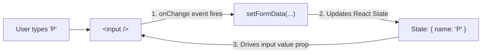

# ⚛️ Unit 3 — Step 5: Controlled Forms & Real-Time Validation

> **Git Branch:** `05-controlled-forms-validation`  
> **Topic:** Controlled Components, Event Interception (`e.preventDefault()`), Compound State Objects, and Input Validation  
> **Pain Point:** Form submission triggers browser page reloads (wiping React state); unvalidated input leads to corrupt data.

---

## 🔴 The Pain Point: The Page Reload Disaster

In traditional HTML, forms submit by sending an HTTP request and reloading the entire page:

```html
<!-- ❌ Traditional HTML Form: Reloads the page! -->
<form action="/register" method="POST">
  <input name="rollNo" />
  <button type="submit">Submit</button>
</form>
```

When the student submits this form:
1. The browser triggers a full white-screen reload.
2. All JavaScript variables, including React `useState` counters and filters, are completely destroyed and reset to 0!
3. Single Page Application (SPA) continuity is broken.

Furthermore, if the student types their roll number in lowercase (`22cs045`) or leaves their email blank, the form submits anyway without client-side safety checks.

---

## 🛡️ Step 1: Intercepting the Submit Event with `e.preventDefault()`

In React, we handle form submissions using the `onSubmit` synthetic event and call `e.preventDefault()` to stop the browser's default reload behavior:

```jsx
const handleSubmit = (e) => {
  e.preventDefault(); // 🛑 Stops the browser from reloading the page!
  console.log("Form submitted safely in pure JavaScript without page refresh!");
};
```

---

## 🎛️ Controlled vs Uncontrolled Components

In HTML, `<input>` elements natively manage their own internal state (whatever the user types is stored in the DOM element).

In React, we build **Controlled Components**, where React state is the **Single Source of Truth**:



### The Controlled Input Contract:
1. **Value prop bound to state:** `value={formData.name}`
2. **Change handler updates state:** `onChange={(e) => setFormData({ ...formData, name: e.target.value })}`

Because React controls the value, you can transform it instantly (e.g. force uppercase for roll numbers):
```jsx
<input 
  type="text"
  value={formData.rollNo}
  onChange={(e) => setFormData({ ...formData, rollNo: e.target.value.toUpperCase() })}
  className="uppercase"
  placeholder="22CS045"
/>
```

---

## 📦 Managing Multi-Field Forms with Compound State

Instead of declaring 4 separate `useState` hooks (`const [name, setName] = useState('')`, `const [rollNo, setRollNo] = useState('')`, etc.), group related form fields into a **single state object**:

```jsx
const [formData, setFormData] = useState({
  name: '',
  rollNo: '',
  email: '',
  phone: ''
});
```

### ⚡ Generic Change Handler using Computed Property Names:
Instead of writing 4 separate `onChange` functions, write one universal handler using HTML `name` attributes:

```jsx
const handleChange = (e) => {
  const { name, value } = e.target;
  setFormData(prev => ({
    ...prev,
    [name]: value // Dynamic computed object property!
  }));
};
```

---

## 🏛️ Building the KIOT Fest Registration Modal

Inspect [`src/components/RegistrationModal.jsx`](file:///Users/apple/Downloads/dev/KIOT/react_nextjs/kiot_fest/src/components/RegistrationModal.jsx):

```jsx
import React, { useState } from 'react';

export default function RegistrationModal({ event, onClose, onSuccess }) {
  const [formData, setFormData] = useState({
    name: '',
    rollNo: '',
    email: '',
    phone: ''
  });
  const [error, setError] = useState('');

  const handleSubmit = (e) => {
    e.preventDefault();

    // 1. Validation: Required fields
    if (!formData.name.trim() || !formData.rollNo.trim()) {
      setError('Student name and Roll number are required!');
      return;
    }

    // 2. Validation: College email verification
    if (!formData.email.includes('@') || !formData.email.endsWith('kiot.ac.in')) {
      setError('Please enter a valid KIOT institutional email (@kiot.ac.in)!');
      return;
    }

    // 3. Validation: 10-digit mobile number
    if (!/^\d{10}$/.test(formData.phone)) {
      setError('Mobile number must be exactly 10 numeric digits!');
      return;
    }

    // Clear errors and notify parent
    setError('');
    onSuccess(formData);
  };

  return (
    <div className="fixed inset-0 bg-black/80 backdrop-blur-sm flex items-center justify-center p-4 z-50 animate-fadeIn">
      <div className="bg-slate-900 border border-slate-800 p-6 rounded-2xl max-w-md w-full text-white space-y-4 shadow-2xl">
        <div className="flex justify-between items-center">
          <h3 className="text-xl font-bold">Register for {event?.title}</h3>
          <button onClick={onClose} className="text-slate-400 hover:text-white text-lg">✕</button>
        </div>

        {/* Error Alert */}
        {error && (
          <div className="p-3 bg-rose-500/20 border border-rose-500/40 rounded-xl text-rose-300 text-xs font-semibold">
            ⚠️ {error}
          </div>
        )}

        <form onSubmit={handleSubmit} className="space-y-3 text-xs">
          <div>
            <label className="block text-slate-400 mb-1">Student Full Name *</label>
            <input 
              type="text" 
              name="name"
              value={formData.name}
              onChange={(e) => setFormData({ ...formData, name: e.target.value })}
              className="w-full p-2.5 bg-slate-800 border border-slate-700 rounded-xl text-white focus:border-indigo-500 outline-none"
              placeholder="e.g. Priyadharshini S"
            />
          </div>

          <div>
            <label className="block text-slate-400 mb-1">Roll Number *</label>
            <input 
              type="text" 
              name="rollNo"
              value={formData.rollNo}
              onChange={(e) => setFormData({ ...formData, rollNo: e.target.value.toUpperCase() })}
              className="w-full p-2.5 bg-slate-800 border border-slate-700 rounded-xl text-white uppercase focus:border-indigo-500 outline-none"
              placeholder="e.g. 22CS045"
            />
          </div>

          <div>
            <label className="block text-slate-400 mb-1">Institutional Email *</label>
            <input 
              type="email" 
              name="email"
              value={formData.email}
              onChange={(e) => setFormData({ ...formData, email: e.target.value })}
              className="w-full p-2.5 bg-slate-800 border border-slate-700 rounded-xl text-white focus:border-indigo-500 outline-none"
              placeholder="student@kiot.ac.in"
            />
          </div>

          <div>
            <label className="block text-slate-400 mb-1">Mobile Phone (10 Digits) *</label>
            <input 
              type="tel" 
              name="phone"
              value={formData.phone}
              onChange={(e) => setFormData({ ...formData, phone: e.target.value })}
              className="w-full p-2.5 bg-slate-800 border border-slate-700 rounded-xl text-white focus:border-indigo-500 outline-none"
              placeholder="9876543210"
              maxLength={10}
            />
          </div>

          <div className="flex gap-2 pt-2">
            <button 
              type="button" 
              onClick={onClose} 
              className="flex-1 py-2.5 bg-slate-800 hover:bg-slate-700 rounded-xl font-bold transition"
            >
              Cancel
            </button>
            <button 
              type="submit" 
              className="flex-1 py-2.5 bg-indigo-600 hover:bg-indigo-500 rounded-xl font-bold transition shadow-lg shadow-indigo-600/30"
            >
              Confirm Pass
            </button>
          </div>
        </form>
      </div>
    </div>
  );
}
```

---

## 🔴 The Pain Point Leading to Step 6

Until now, our fest events have been hardcoded inside an in-memory JavaScript array (`const ALL_EVENTS = [...]`).

In production, college events are stored in a database and fetched via an asynchronous REST API (`/api/events`).

Now imagine a beginner writing this in React:
```jsx
// ❌ CRITICAL BUG: The Infinite Re-render Loop!
export default function HomePage() {
  const [events, setEvents] = useState([]);

  // Fetching directly in the component body:
  fetch('/api/events')
    .then(res => res.json())
    .then(data => {
      setEvents(data); // Triggers re-render!
    });

  return <div>{events.length} events found</div>;
}
```

### What happens when this runs?
1. Component mounts and renders.
2. `fetch()` runs and completes.
3. `setEvents(data)` updates state $\to$ **triggers a re-render**.
4. The component body executes again from top to bottom.
5. `fetch()` runs **AGAIN**!
6. `setEvents(data)` runs **AGAIN** $\to$ triggers another re-render!
7. **Infinite loop!** The browser freezes, memory leaks, and the backend server is flooded with 1,000 requests per second!

How does React safely handle side effects like data fetching without entering infinite loops?

---

## ⏭️ Next Step: The Lifecycle & Side Effects Hook
Proceed to **[Unit 3 — Step 6: useEffect & API Integration](./06-useeffect-and-api-integration.md)**!
