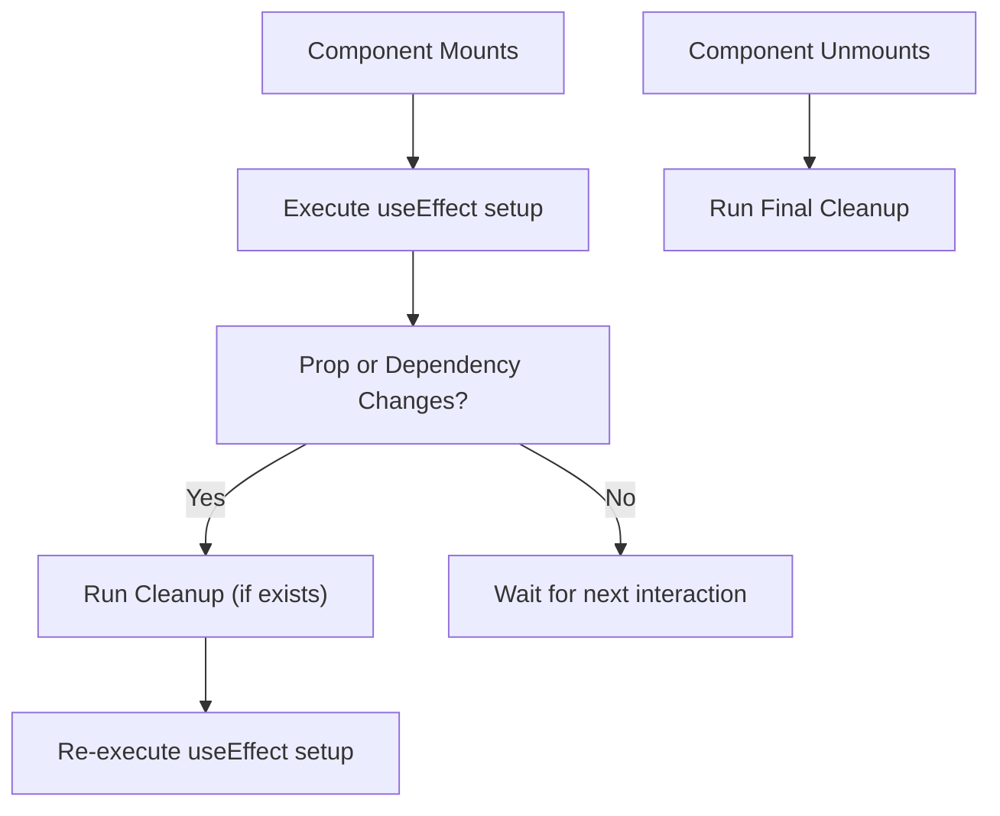

# ⚛️ Unit 3 — Step 6: useEffect & API Integration

> **Git Branch:** `06-useeffect-and-api-integration`  
> **Topic:** The `useEffect` Hook, Side Effects Lifecycle, Dependency Arrays, Async Data Fetching, and Loading Skeletons  
> **Pain Point:** Placing asynchronous network requests directly in the component body creates an infinite re-render loop that crashes the browser.

---

## 🔴 The Pain Point: The Infinite Re-render Loop

In Step 5, we observed that calling `setEvents()` triggers a re-render. If `fetch()` sits directly in the component body:

```
Render Component ──▶ fetch('/api/events') ──▶ setEvents(data)
       ▲                                              │
       └────────────────── Re-render ─────────────────┘
```

This cycle executes hundreds of times per second until the browser runs out of memory or the server blocks your IP address.

To fix this, React provides the **`useEffect`** Hook to manage **Side Effects**.

---

## 💡 What is a Side Effect?

In React, a component render should ideally be a **pure function**: given the same props and state, it should return the exact same JSX without modifying anything outside itself.

A **Side Effect** is any operation that reaches outside the component's pure rendering calculations:
- Fetching data from a backend REST API.
- Subscribing to browser events or WebSockets.
- Setting timers (`setTimeout`, `setInterval`).
- Reading or writing to `localStorage`.
- Manually modifying the document title (`document.title = "KIOT Fest"`).

---

## ⚙️ Anatomy of `useEffect`

```jsx
import { useEffect } from 'react';

useEffect(() => {
  // 1. SETUP CODE: Runs after the DOM has been painted
  
  return () => {
    // 2. CLEANUP CODE: Runs when component unmounts or before re-running setup
  };
}, [dependencies]); // 3. DEPENDENCY ARRAY
```

### The 3 Golden Rules of the Dependency Array:

| Configuration | Syntax | When Does It Run? | Common Use Case |
| :--- | :--- | :--- | :--- |
| **Empty Array** | `useEffect(fn, [])` | **Runs ONCE** when the component first mounts (birth). | Initial API data loading on page load. |
| **With Dependencies** | `useEffect(fn, [dept, query])` | Runs on mount **AND** whenever `dept` or `query` changes. | Live filtering, debounced search fetching. |
| **No Array** | `useEffect(fn)` | Runs on **EVERY SINGLE RENDER**. | ⚠️ Dangerous! Never call state setters here. |



---

## 📡 Proper Asynchronous Data Fetching Pattern

### ⚠️ Common Student Mistake: `async` on the Effect Callback
```jsx
// ❌ SYNTAX ERROR: useEffect callback cannot be async!
// Because an async function returns a Promise, but useEffect expects either undefined or a cleanup function!
useEffect(async () => {
  const res = await fetch('/api/events');
}, []);

// ✅ CORRECT: Define an inner async function and call it:
useEffect(() => {
  async function fetchEvents() {
    try {
      setLoading(true);
      const res = await fetch('/api/events');
      const data = await res.json();
      setEvents(data);
    } catch (err) {
      setError(err.message);
    } finally {
      setLoading(false);
    }
  }

  fetchEvents();
}, []); // Empty dependency array: runs only once!
```

---

## 💀 Eliminating Layout Shift: Loading Skeletons vs Spinners

Traditional websites show a tiny spinning circle in the center of the screen. When data finally arrives, the cards suddenly pop into view, jolting the entire page layout. This is called **Cumulative Layout Shift (CLS)** and creates an unpleasant, jarring user experience.

Modern production applications (like YouTube, LinkedIn, and KIOT Fest) use **Shimmer Loading Skeletons** that mirror the exact dimensions of the incoming cards.

Inspect [`src/components/LoadingSkeleton.jsx`](file:///Users/apple/Downloads/dev/KIOT/react_nextjs/kiot_fest/src/components/LoadingSkeleton.jsx):

```jsx
import React from 'react';

export default function LoadingSkeleton({ count = 4 }) {
  return (
    <div className="grid grid-cols-1 md:grid-cols-2 gap-6 animate-pulse">
      {Array.from({ length: count }).map((_, index) => (
        <div
          key={index}
          className="p-6 bg-slate-900/60 border border-slate-800 rounded-2xl h-52 flex flex-col justify-between"
        >
          <div className="space-y-3">
            {/* Department Badge Placeholder */}
            <div className="h-4 w-16 bg-slate-800 rounded-full" />
            {/* Title Placeholder */}
            <div className="h-6 w-3/4 bg-slate-800 rounded-md" />
            {/* Description Lines */}
            <div className="h-3 w-full bg-slate-800/60 rounded" />
            <div className="h-3 w-4/5 bg-slate-800/60 rounded" />
          </div>

          {/* Card Footer Placeholder */}
          <div className="flex justify-between items-center pt-4 border-t border-slate-800/60">
            <div className="h-4 w-20 bg-slate-800 rounded" />
            <div className="h-8 w-24 bg-slate-800 rounded-xl" />
          </div>
        </div>
      ))}
    </div>
  );
}
```

---

## 🧹 Memory Leak Prevention: The Cleanup Function

Imagine a student clicks on *"Flagship Competitions"*, which triggers a 3-second database fetch. After 1 second, before the data arrives, the student clicks away to *"About Us"*.

If you do not cancel the in-flight request:
1. The fetch completes in the background.
2. The code attempts to call `setEvents(data)` on an unmounted component!
3. React displays a memory leak error in the browser console.

### The Modern Solution: `AbortController`
```jsx
useEffect(() => {
  // 1. Create an AbortController instance
  const controller = new AbortController();

  async function loadData() {
    try {
      const res = await fetch('/api/events', { signal: controller.signal });
      const data = await res.json();
      setEvents(data);
    } catch (err) {
      if (err.name !== 'AbortError') {
        setError(err.message);
      }
    }
  }

  loadData();

  // 2. Return cleanup function to cancel request if component unmounts
  return () => {
    controller.abort();
  };
}, []);
```

---

## 🔴 The Pain Point Leading to Step 7

Look at our browser's address bar right now: `http://localhost:3000/`.

All fest interactions occur on this single URL:
1. If a student wants to share the **"Web Hackathon"** competition on WhatsApp, they cannot share a direct link like `kiotfest.com/events/1`.
2. Clicking the browser's **Back** button exits the website entirely instead of navigating to the previous page.
3. If we link pages using plain HTML `<a href="/events/1">`, the browser triggers a full page refresh, destroying all loaded data!

How do we build a multi-page experience with dynamic routes (`/events/:id`) that navigates instantaneously without browser reloads?

---

## ⏭️ Next Step: Client-Side Routing & Dynamic SPAs
Proceed to **[Unit 3 — Step 7: React Router & Dynamic SPAs](./07-react-router-spa.md)**!
