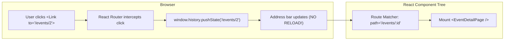

# ⚛️ Unit 3 — Step 7: React Router & Dynamic SPAs

> **Git Branch:** `07-react-router-spa`  
> **Topic:** Single Page Application (SPA) Routing, Client-Side Navigation, Dynamic Routes (`/events/:id`), and URL Parameters  
> **Pain Point:** Traditional `<a>` links trigger full-page browser reloads; state is lost when moving between pages.

---

## 🔴 The Pain Point: The Multi-Page Dilemma

Until now, our fest website lived entirely on a single URL (`/`).

When students asked to view the complete rulebook, schedule, and judging criteria for **Web Hackathon 2026**, our only options were:
1. Cram 500 lines of text into the small card (cluttering the homepage).
2. Open a new HTML file using `<a href="/events/1.html">`.

### What happens when you use `<a href="...">` in an SPA?
```html
<!-- ❌ Traditional Link: Destroys React Memory! -->
<a href="/events/1">View Event Details</a>
```
When clicked:
1. The browser makes a new HTTP request to the server.
2. The entire webpage unloads, producing a visible **white-screen flash**.
3. All React `useState` data (such as the student's registration count and search filters) is completely wiped from memory.

---

## 💡 How Single Page Application (SPA) Routing Works

In a modern SPA, the browser loads the HTML/JavaScript bundle **only once**.

When the user clicks a link:
1. React Router intercepts the click event and prevents the default browser reload (`e.preventDefault()`).
2. It uses the browser's **HTML5 History API** (`window.history.pushState()`) to update the URL in the address bar without reloading.
3. React Router matches the new URL to a registered route and swaps the visible component on screen instantaneously (under 16 milliseconds!).



---

## 🛠️ Core Concepts of `react-router-dom`

### 1. The Route Configuration
In a standard React application, routes are configured inside the root component (`App.jsx`):

```jsx
import { BrowserRouter, Routes, Route } from 'react-router-dom';
import HomePage from './pages/HomePage';
import EventsPage from './pages/events/EventsPage';
import EventDetailPage from './pages/events/EventDetailPage';
import NotFoundPage from './pages/NotFoundPage';

export default function App() {
  return (
    <BrowserRouter>
      <Navbar />
      <Routes>
        {/* Static Routes */}
        <Route path="/" element={<HomePage />} />
        <Route path="/events" element={<EventsPage />} />

        {/* Dynamic Parameter Route */}
        <Route path="/events/:id" element={<EventDetailPage />} />

        {/* 404 Catch-All Route */}
        <Route path="*" element={<NotFoundPage />} />
      </Routes>
    </BrowserRouter>
  );
}
```

---

### 2. Client-Side Navigation: `<Link>` vs `<a>`

Never use standard `<a href="...">` tags for internal links. Always use React Router's `<Link>` or `<NavLink>` component:

```jsx
import { Link } from 'react-router-dom';

// In EventCard.jsx:
<Link 
  to={`/events/${id}`}
  className="text-xs font-bold text-indigo-400 hover:text-indigo-300"
>
  View Rulebook & Schedule →
</Link>
```

#### `<NavLink>` for Active Navigation Links
`<NavLink>` automatically injects an `isActive` boolean so you can highlight the active page in your `Navbar`:

```jsx
import { NavLink } from 'react-router-dom';

<NavLink
  to="/events"
  className={({ isActive }) =>
    isActive ? "text-indigo-400 font-bold border-b-2 border-indigo-500" : "text-slate-400"
  }
>
  All Competitions
</NavLink>
```

---

### 3. Dynamic Routes & URL Parameters with `useParams()`

Notice the colon `:` in `path="/events/:id"`. This denotes a **dynamic route parameter**. Any value typed after `/events/` will be captured by React Router.

Inside the destination component (`EventDetailPage.jsx` or Next.js `src/pages/events/[id].js`), we extract this parameter using the **`useParams()`** Hook:

```jsx
import { useParams, Link } from 'react-router-dom';
import { ALL_EVENTS } from '../../data/events';

export default function EventDetailPage() {
  // 1. Extract the dynamic parameter from the URL:
  const { id } = useParams();

  // 2. Find the matching event from data:
  const event = ALL_EVENTS.find(e => String(e.id) === String(id));

  // 3. Handle invalid IDs gracefully:
  if (!event) {
    return (
      <div className="p-12 text-center text-white">
        <h2 className="text-2xl font-bold">Event Not Found</h2>
        <Link to="/events" className="text-indigo-400 mt-4 inline-block">
          ← Return to All Events
        </Link>
      </div>
    );
  }

  return (
    <div className="max-w-4xl mx-auto p-8 text-white">
      <Link to="/events" className="text-xs text-slate-400 hover:text-indigo-400">
        ← Back to Competitions
      </Link>
      
      <div className="mt-4 p-8 bg-slate-900 border border-slate-800 rounded-3xl space-y-6">
        <div className="flex justify-between items-start">
          <div>
            <span className="text-xs font-bold px-3 py-1 bg-indigo-500/20 text-indigo-300 rounded-full">
              {event.department}
            </span>
            <h1 className="text-4xl font-black mt-3">{event.title}</h1>
          </div>
          <span className="text-2xl font-black text-amber-400">{event.prize}</span>
        </div>

        <p className="text-slate-300 leading-relaxed">{event.description}</p>

        <div className="grid grid-cols-2 sm:grid-cols-3 gap-4 pt-4 border-t border-slate-800 text-xs">
          <div className="bg-slate-800/40 p-4 rounded-xl">
            <span className="text-slate-400 block mb-1">Registration Fee</span>
            <span className="text-lg font-bold text-white">₹{event.fee}</span>
          </div>
          <div className="bg-slate-800/40 p-4 rounded-xl">
            <span className="text-slate-400 block mb-1">Seats Available</span>
            <span className="text-lg font-bold text-white">{event.seatsLeft} Remaining</span>
          </div>
          <div className="bg-slate-800/40 p-4 rounded-xl">
            <span className="text-slate-400 block mb-1">Date & Venue</span>
            <span className="text-lg font-bold text-white">{event.date}</span>
          </div>
        </div>
      </div>
    </div>
  );
}
```

---

### 4. Programmatic Navigation with `useNavigate()`

Sometimes you need to redirect the user through code (e.g. after a form submits successfully):

```jsx
import { useNavigate } from 'react-router-dom';

export default function RegistrationForm() {
  const navigate = useNavigate();

  const handleSuccess = () => {
    // Redirect the student to their confirmation pass:
    navigate('/my-tickets');
  };
}
```

---

## ⚡ Next.js Note: File-Based Routing

In **Next.js** (which we dive into on Day 2 in Unit 5), routing does not require manual `<Routes>` or `<Route>` tags!

Next.js automatically generates routes based on your folder and file structure inside `src/pages/`:
- `src/pages/index.js` $\longrightarrow$ `/` (Home Page)
- `src/pages/events/index.js` $\longrightarrow$ `/events` (Catalog Page)
- `src/pages/events/[id].js` $\longrightarrow$ `/events/:id` (Dynamic Event Page)

The concept and user experience remain identical: client-side, zero-reload routing!

---

## 🔴 The Grand Revelation: The Prop Drilling Nightmare

You have completed **Unit 3: React Fundamentals**! You now know components, JSX, props, state, conditional rendering, controlled forms, side effects, and routing.

Now, look at the architectural wall our app just hit:

### The Scenario:
1. The student navigates to `/events/1` (Web Hackathon 2026).
2. They fill out the registration modal and click **Confirm**.
3. They click the `<Link to="/">` button in the navbar to return home.

### The Problem:
**The registration badge in the Navbar shows 0!**

Why? Because when the user navigated away from the page, `EventDetailPage` unmounted. Its local `useState` was destroyed!

To fix this with pure React, we would have to lift the cart and registration state all the way up to `App.jsx`, and manually pass `cart`, `setCart`, `registerCount`, and `setRegisterCount` down through 4 layers of intermediate components:

```
App ──▶ Layout ──▶ Page ──▶ EventGrid ──▶ EventCard ──▶ RegisterButton
```

Every intermediary component is forced to accept props it doesn't even need, just to forward them down one level!

This is the infamous **Prop Drilling Nightmare**.

---

## 🎯 Transition to Day 2: Unit 4 (Redux Toolkit)

Tomorrow morning at 09:00 AM, we begin **Unit 4: State Complexity & Redux Toolkit (RTK)**:
- We will see why React Context API causes performance bottlenecks with excessive re-renders.
- We will build a centralized **Redux Store** with `cartSlice` and `eventSlice`.
- Any component anywhere in the tree (`Navbar`, `EventCard`, `CartDrawer`) will be able to read and update global state with 2 clean lines of code using `useSelector` and `useDispatch`!

👉 See you tomorrow in **[Unit 4: Why Redux? Solving the Prop-Drilling Nightmare](../unit4_redux_guide/why-redux-over-props.md)**!
