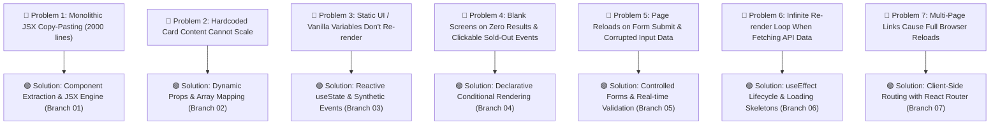

# ⚛️ Unit 3: React Fundamentals with Problem-Driven Learning

> **KIOT FEST 2026 — 2-Day College Fullstack Web Development Workshop**  
> **Target Audience:** 3rd-Year Computer Science & Engineering Students  
> **Session Time:** Day 1 (14:00 - 17:30)  
> **Core Philosophy:** *Never introduce a solution before students experience the pain of the problem.*

---

## 🎯 Unit 3 Overview

In **Units 0, 1, and 2**, we established the historical foundations of HTML/CSS, mastered modern ES6+ JavaScript, and designed our KIOT Fest UI/UX prototypes in Figma.

Now in **Unit 3**, we build the interactive frontend of **KIOT Fest (College Technical & Cultural Fest Portal)** using **React.js**. Instead of teaching abstract syntax in isolation, Unit 3 is structured around **7 Real-World Engineering Problems**. Each problem exposes a critical failure mode or architectural bottleneck in web development, and introduces the exact React concept that cleanly solves it.



---

## 🗺️ Curriculum Roadmap & Branch Mapping

Every lesson in this unit directly corresponds to a dedicated Git branch in this repository. Students can switch branches at any time to inspect the before/after code:

| # | Lesson Guide | Git Branch | Core Engineering Problem Solved |
| :--- | :--- | :--- | :--- |
| **01** | [01. Why React & JSX](./01-why-react-and-jsx.md) | `01-react-setup-and-jsx` | Monolithic HTML copy-pasting $\to$ Component composition & Virtual DOM diffing. |
| **02** | [02. Components & Props](./02-components-and-props.md) | `02-components-and-props` | Hardcoded card data $\to$ Dynamic `props`, destructuring & list rendering with `key`. |
| **03** | [03. useState & Synthetic Events](./03-usestate-and-synthetic-events.md) | `03-state-and-event-handling` | Static UI $\to$ Reactive state management, two-way binding, and live event counters. |
| **04** | [04. Conditional Rendering](./04-conditional-rendering.md) | `04-conditional-rendering` | Unhandled edge cases $\to$ Empty states, Sold-Out badges, and active tab highlights. |
| **05** | [05. Controlled Forms & Validation](./05-controlled-forms-and-validation.md) | `05-controlled-forms-validation` | Page refresh on submit $\to$ Controlled inputs, `e.preventDefault()`, and modal dialogs. |
| **06** | [06. useEffect & API Integration](./06-useeffect-and-api-integration.md) | `06-useeffect-and-api-integration` | Infinite fetch loops $\to$ Hook dependency arrays, async fetch, and loading skeletons. |
| **07** | [07. React Router & Dynamic SPAs](./07-react-router-spa.md) | `07-react-router-spa` | Full-page browser reloads $\to$ Client-side routing, URL parameters (`/events/:id`). |

---

## 🏗️ KIOT Fest Component Architecture

By the end of Unit 3, our application forms a modular, unidirectional component hierarchy:

```
src/
├── components/
│   ├── Navbar.jsx              # Global branding, links, and live registration badge
│   ├── EventCard.jsx           # Reusable event card with conditional badges & register action
│   ├── EventFilters.jsx        # Search bar & department pills with active indicators
│   ├── RegistrationModal.jsx   # Controlled registration form with instant field validation
│   └── LoadingSkeleton.jsx     # Shimmer skeleton loader for asynchronous data fetching
├── pages/
│   ├── _app.js                 # Global CSS imports and root layout wrapper
│   ├── index.js                # Fest home page: Hero banner, filter state, and event grid
│   └── events/
│       ├── index.js            # Dedicated events catalogue page
│       └── [id].js             # Dynamic detail page for individual competitions
└── styles/
    └── globals.css             # Tailwind CSS & custom glassmorphism utilities
```

---

## 🚀 Quick Start for Students

### 1. Check out the starting branch:
```bash
git checkout 01-react-setup-and-jsx
```

### 2. Start the local development server:
```bash
npm install
npm run dev
```
Open your browser at `http://localhost:3000` to inspect the live running demo.

### 3. Step through the branches as you progress through each guide:
```bash
git checkout 02-components-and-props
git checkout 03-state-and-event-handling
git checkout 04-conditional-rendering
git checkout 05-controlled-forms-validation
git checkout 06-useeffect-and-api-integration
git checkout 07-react-router-spa
```

---

## 💡 How to Get the Most Out of This Unit
1. **Always predict the re-render:** Before running any state change, ask yourself: *"Which components will re-render, and why?"*
2. **Keep the React DevTools open:** Install the React Developer Tools extension in Chrome/Edge. Inspect the Component Tree, view live props and state, and trace re-renders.
3. **Notice the transition to Unit 4:** When you complete Step 7, notice how awkward it is to share registration data between the event catalog page and the navbar. That exact limitation introduces **Unit 4: Redux Toolkit (RTK)** on Day 2!
