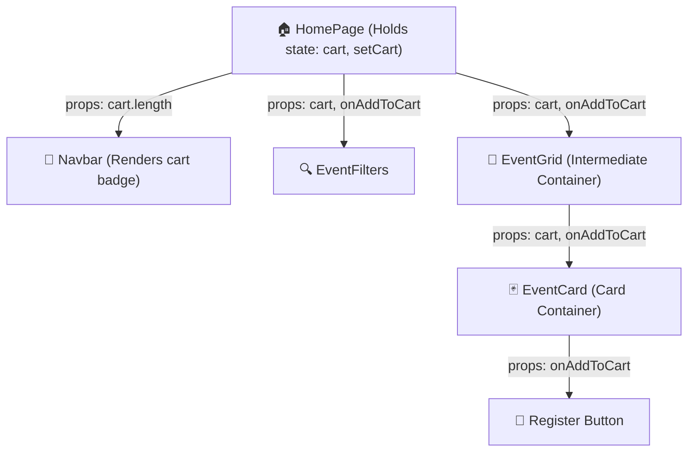

# 📦 08. The Prop-Drilling Problem: Why Component Trees Break Down

> **Git Branch:** `08-prop-drilling-problem`  
> **Difficulty:** Intermediate  
> **Prerequisites:** Unit 3 (React Components, Props, useState)

---

## 🎯 The Engineering Problem

In our **KIOT Fest** portal, students can browse workshops and hackathons, click **"Register / Add to Cart"**, and see their live registration count increment in the top **Navbar**.

To make this work using standard React state (`useState`), where must the `cart` state live?

Because React enforces a **unidirectional data flow** (data flows down from parent to child via `props`), the `cart` state must be lifted up to their **lowest common ancestor**—in our case, `HomePage` (or `_app.js`):



### 🔴 The Failure Modes:
1. **Pass-Through Pollution (Prop Drilling)**:  
   Notice `EventGrid`. It does **not** use the `cart` array, nor does it register students. Yet, its signature is forced to accept `cart` and `onAddToCart` solely to forward them down to `EventCard`.
2. **Brittle Refactoring**:  
   If you wrap `EventCard` inside a new component (e.g. `<SpotlightSection>` or `<DepartmentTabs>`), you must modify the props in every single intermediate file. Missing just one prop link silently breaks the register button.
3. **Loss of State on Navigation**:  
   If the student navigates from `/` (Home) to `/events/ev-1` (Details Page), the `HomePage` component unmounts, and all registration state is permanently wiped out!

---

## 💻 Code Implementation (Branch 08)

### 1. Root Level State: `src/pages/index.js`
In `HomePage`, we define our state and handler functions:

```jsx
import { useState } from 'react';
import Navbar from '../components/Navbar';
import EventCard from '../components/EventCard';
import EventFilters from '../components/EventFilters';
import { initialEvents } from '../data/events';

export default function HomePage() {
  const [events] = useState(initialEvents);
  const [cart, setCart] = useState([]);
  const [selectedDept, setSelectedDept] = useState('ALL');
  const [searchQuery, setSearchQuery] = useState('');

  // Handler passed down 4 levels!
  const handleAddToCart = (event) => {
    if (!cart.some(item => item.id === event.id)) {
      setCart(prev => [...prev, event]);
    }
  };

  const handleRemoveFromCart = (eventId) => {
    setCart(prev => prev.filter(item => item.id !== eventId));
  };

  return (
    <div className="min-h-screen bg-[#0a0f1d] text-slate-100">
      {/* Navbar receives cart count */}
      <Navbar cartCount={cart.length} />

      <main className="max-w-7xl mx-auto px-4 py-8">
        <EventFilters 
          selectedDept={selectedDept} 
          onSelectDept={setSelectedDept}
          searchQuery={searchQuery}
          onSearchChange={setSearchQuery}
        />

        {/* Prop Drilling starts here: Passing cart & handlers into the grid */}
        <div className="grid grid-cols-1 md:grid-cols-2 lg:grid-cols-3 gap-6 mt-8">
          {events.map(event => (
            <EventCard 
              key={event.id}
              event={event}
              isInCart={cart.some(item => item.id === event.id)}
              onAddToCart={handleAddToCart}
              onRemoveFromCart={handleRemoveFromCart}
            />
          ))}
        </div>
      </main>
    </div>
  );
}
```

### 2. Intermediate Level: `src/components/EventCard.jsx`
`EventCard` receives `isInCart`, `onAddToCart`, and `onRemoveFromCart` and proxies them to the button:

```jsx
export default function EventCard({ event, isInCart, onAddToCart, onRemoveFromCart }) {
  return (
    <div className="bg-slate-900/80 border border-slate-800 rounded-2xl p-6 flex flex-col justify-between">
      <div>
        <span className="text-xs font-semibold px-2.5 py-1 rounded-full bg-indigo-500/10 text-indigo-400 border border-indigo-500/20">
          {event.department}
        </span>
        <h3 className="text-xl font-bold text-white mt-3">{event.title}</h3>
        <p className="text-slate-400 text-sm mt-2">{event.description}</p>
      </div>

      <div className="mt-6 pt-4 border-t border-slate-800/80 flex items-center justify-between">
        <span className="text-lg font-extrabold text-amber-400">
          {event.registrationFee === 0 ? 'FREE' : `₹${event.registrationFee}`}
        </span>

        {isInCart ? (
          <button 
            onClick={() => onRemoveFromCart(event.id)}
            className="px-4 py-2 rounded-xl text-sm font-semibold bg-rose-500/20 text-rose-300 border border-rose-500/30 hover:bg-rose-500/30 transition-all"
          >
            Remove
          </button>
        ) : (
          <button 
            onClick={() => onAddToCart(event)}
            className="px-4 py-2 rounded-xl text-sm font-semibold bg-indigo-600 text-white hover:bg-indigo-500 shadow-lg shadow-indigo-500/25 transition-all"
          >
            Add to Cart
          </button>
        )}
      </div>
    </div>
  );
}
```

---

## 🧪 Try It Yourself: The Fragility Test

1. Check out branch `08-prop-drilling-problem`:
   ```bash
   git checkout 08-prop-drilling-problem
   npm run dev
   ```
2. Open `http://localhost:3000` in your browser.
3. Click **"Add to Cart"** on any event card. Observe the counter badge in the `Navbar` updating to `1`.
4. Now, imagine marketing asks to add a **`<CartDrawer>`** sidebar that slides in when clicking the Navbar badge.
   - Where must the drawer component be placed?
   - How does the `Navbar` trigger the drawer if the state is in `HomePage`?
   - To make it work, you must lift `isDrawerOpen` and `cart` even higher, or pass callbacks through `Navbar` $\to$ `HomePage` $\to$ `CartDrawer`.

---

## 💡 Key Architectural Takeaways

| Dimension | Prop-Drilling Approach |
| :--- | :--- |
| **Component Decoupling** | 🔴 **Terrible**: Intermediate components are tightly coupled to data they do not consume. |
| **Refactoring Burden** | 🔴 **High**: Renaming or adding a prop requires editing every layer in the chain. |
| **Code Readability** | 🔴 **Cluttered**: Function signatures are bloated with pass-through props. |
| **When is it okay?** | Only for shallow 1-level parent-to-child communication (e.g. `Modal` $\to$ `CloseButton`). |

**Next Step:** Can React's built-in `createContext` save us? Let's move to **[09. useContext & Limitations](./09-usecontext-and-limitations.md)** to find out!
