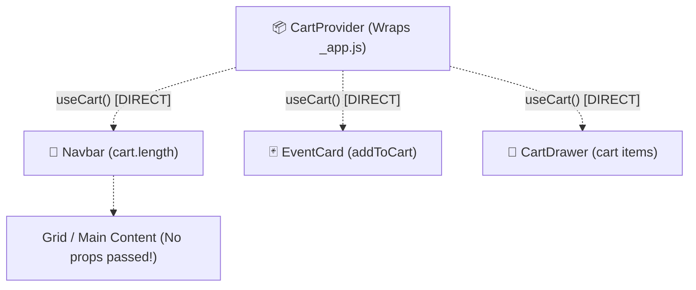
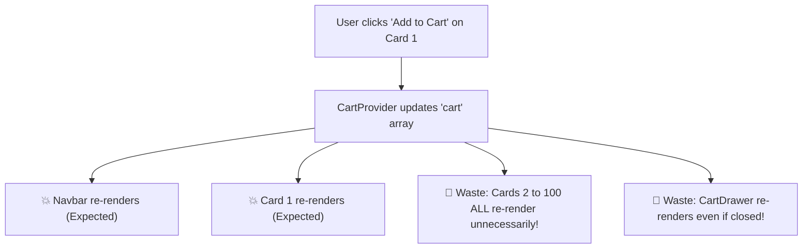

# 🌐 09. The React Context API & Its Critical Limitations

> **Git Branch:** `09-usecontext-and-limitations`  
> **Difficulty:** Intermediate  
> **Prerequisites:** 08-prop-drilling-problem

---

## 🎯 The Solution Attempt: Teleporting State with `useContext`

In **Branch 08**, passing `cart` down through 4 tiers of intermediate components broke encapsulation and made refactoring risky.

React provides a native solution: **The Context API (`createContext` + `useContext`)**.  
Think of Context as a **teleportation portal** for state. Any component inside a `<CartProvider>` can reach directly into the context and grab the state or dispatch methods without bothering any intermediate parents!



---

## 💻 Code Implementation (Branch 09)

### 1. Creating the Context: `src/context/CartContext.js`
We encapsulate the cart state, functions, and a custom hook `useCart()`:

```jsx
import { createContext, useContext, useState } from 'react';

const CartContext = createContext(null);

export function CartProvider({ children }) {
  const [cart, setCart] = useState([]);
  const [isDrawerOpen, setIsDrawerOpen] = useState(false);

  const addToCart = (event) => {
    setCart((prev) => {
      if (prev.some((item) => item.id === event.id)) return prev;
      return [...prev, event];
    });
  };

  const removeFromCart = (eventId) => {
    setCart((prev) => prev.filter((item) => item.id !== eventId));
  };

  const toggleDrawer = () => setIsDrawerOpen((prev) => !prev);

  const totalFee = cart.reduce((sum, item) => sum + (item.registrationFee || 0), 0);

  return (
    <CartContext.Provider
      value={{
        cart,
        cartCount: cart.length,
        totalFee,
        isDrawerOpen,
        addToCart,
        removeFromCart,
        toggleDrawer,
      }}
    >
      {children}
    </CartContext.Provider>
  );
}

export function useCart() {
  const context = useContext(CartContext);
  if (!context) {
    throw new Error('useCart must be used within a CartProvider');
  }
  return context;
}
```

### 2. Wrapping the Root: `src/pages/_app.js`
We mount `<CartProvider>` at the root of the app so that every route shares the same cart:

```jsx
import '../styles/globals.css';
import { CartProvider } from '../context/CartContext';

export default function App({ Component, pageProps }) {
  return (
    <CartProvider>
      <Component {...pageProps} />
    </CartProvider>
  );
}
```

### 3. Consuming Cleanly in `src/components/EventCard.jsx`
Notice how clean the props are now! `EventCard` only needs `event`:

```jsx
import { useCart } from '../context/CartContext';

export default function EventCard({ event }) {
  const { cart, addToCart, removeFromCart } = useCart();
  const isInCart = cart.some((item) => item.id === event.id);

  return (
    <div className="bg-slate-900/80 border border-slate-800 rounded-2xl p-6 flex flex-col justify-between">
      {/* Event Details */}
      <h3 className="text-xl font-bold text-white">{event.title}</h3>
      
      <div className="mt-4 flex items-center justify-between">
        <span className="text-amber-400 font-bold">₹{event.registrationFee}</span>
        {isInCart ? (
          <button 
            onClick={() => removeFromCart(event.id)}
            className="px-4 py-2 rounded-xl bg-rose-500/20 text-rose-300"
          >
            Remove
          </button>
        ) : (
          <button 
            onClick={() => addToCart(event)}
            className="px-4 py-2 rounded-xl bg-indigo-600 text-white"
          >
            Add to Cart
          </button>
        )}
      </div>
    </div>
  );
}
```

---

## ⚠️ The Hidden Trap: The Universal Re-render Problem

While Context solves prop-drilling, it introduces a severe performance and architecture bottleneck:

> **React Context Re-render Rule**:  
> Whenever **any single value** in the Context provider's `value` object changes, **EVERY single component** that calls `useContext(CartContext)` will immediately and unconditionally re-render!

### Visualizing the Waste:
Suppose you have 100 event cards on the screen.
1. The user clicks **Add to Cart** on Card #1.
2. `cart` state updates.
3. The Provider creates a new `value` object.
4. **All 100 `EventCard` components re-render**, even though 99 of them did not change!
5. Even worse: If a component only called `useCart()` just to read `isDrawerOpen`, it will STILL re-render every time an item is added to `cart`!



---

## 📊 Context API vs. Redux Toolkit Comparison

| Feature | React Context API | Redux Toolkit (RTK) |
| :--- | :--- | :--- |
| **Primary Intent** | Dependency injection for low-frequency global settings (Theme, Auth, Language). | Scalable, high-frequency, complex application state. |
| **Subscription Granularity** | 🔴 **Coarse**: Consumers re-render on any context change. | 🟢 **Fine-Grained**: `useSelector(state => state.cart.count)` re-renders **only** when `cart.count` changes. |
| **Async Operations** | 🔴 Manual `useEffect` + boilerplate for pending/error flags. | 🟢 `createAsyncThunk` with structured lifecycle reducers. |
| **Debugging & Auditing** | 🔴 Console.log / React Profiler only. | 🟢 **Redux DevTools**: Action history, state diffs, time travel! |
| **Middleware & Persistence** | 🔴 Custom hook logic required. | 🟢 Pluggable middleware (`localStorage`, logging, RTK Query). |

---

## 🎯 Summary

React Context is excellent for static or infrequently changing configuration (e.g. Dark Mode toggle, Current User Token). But for dynamic eCommerce/registration workflows with carts, filters, and async API data, **Redux Toolkit** is the industry standard.

**Next Step:** Let's upgrade our application to Redux Toolkit in **[10. Redux Toolkit Store & Cart Slice](./10-redux-toolkit-store-and-cart-slice.md)**!
