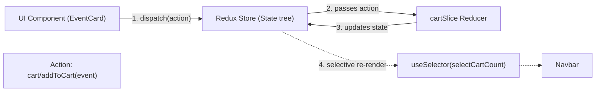

# 🛒 10. Redux Toolkit: Centralized Store & Cart Slice

> **Git Branch:** `10-redux-toolkit-store-and-cart-slice`  
> **Difficulty:** Intermediate to Advanced  
> **Prerequisites:** 09-usecontext-and-limitations

---

## 🎯 What is Redux Toolkit (RTK)?

**Redux Toolkit (RTK)** is the official, opinionated, modern standard for writing Redux logic. It eliminates 90% of legacy Redux boilerplate by combining action creators, action types, and reducers into unified **Slices**, while integrating **Immer** so we can write clean, readable update logic.

### Core RTK Building Blocks:


1. **Store**: The single source of truth for the entire application state.
2. **Slice**: A modular bundle containing the initial state, reducer functions, and generated action creators for a specific domain (e.g. `cartSlice`, `eventSlice`).
3. **Dispatch**: The function used to send actions into the store: `dispatch(addToCart(item))`.
4. **Selector**: A query function that extracts a specific slice of state: `useSelector(state => state.cart.items)`.

---

## 💻 Code Implementation (Branch 10)

### 1. Creating the Cart Slice: `src/redux/slices/cartSlice.js`

```javascript
import { createSlice } from '@reduxjs/toolkit';

const initialState = {
  items: [],
  isDrawerOpen: false,
};

export const cartSlice = createSlice({
  name: 'cart',
  initialState,
  reducers: {
    addToCart: (state, action) => {
      const exists = state.items.some((item) => item.id === action.payload.id);
      if (!exists) {
        // With Immer, we can write 'state.items.push()' directly!
        state.items.push(action.payload);
      }
    },
    removeFromCart: (state, action) => {
      state.items = state.items.filter((item) => item.id !== action.payload);
    },
    clearCart: (state) => {
      state.items = [];
    },
    toggleCartDrawer: (state) => {
      state.isDrawerOpen = !state.isDrawerOpen;
    },
    setCartDrawerOpen: (state, action) => {
      state.isDrawerOpen = action.payload;
    },
  },
});

export const { 
  addToCart, 
  removeFromCart, 
  clearCart, 
  toggleCartDrawer, 
  setCartDrawerOpen 
} = cartSlice.actions;

// Selectors for fine-grained subscriptions
export const selectCartItems = (state) => state.cart.items;
export const selectCartCount = (state) => state.cart.items.length;
export const selectCartTotal = (state) => 
  state.cart.items.reduce((total, item) => total + (item.registrationFee || 0), 0);
export const selectIsDrawerOpen = (state) => state.cart.isDrawerOpen;

export default cartSlice.reducer;
```

### 2. Configuring the Store: `src/redux/store.js`

```javascript
import { configureStore } from '@reduxjs/toolkit';
import cartReducer from './slices/cartSlice';

export const store = configureStore({
  reducer: {
    cart: cartReducer,
  },
  devTools: process.env.NODE_ENV !== 'production',
});
```

### 3. Wrapping Next.js Root: `src/pages/_app.js`

```jsx
import '../styles/globals.css';
import { Provider } from 'react-redux';
import { store } from '../redux/store';
import CartDrawer from '../components/CartDrawer';

export default function App({ Component, pageProps }) {
  return (
    <Provider store={store}>
      <Component {...pageProps} />
      <CartDrawer />
    </Provider>
  );
}
```

### 4. Consuming in Components: `src/components/Navbar.jsx`
The `Navbar` only subscribes to `selectCartCount`:

```jsx
import { useSelector, useDispatch } from 'react-redux';
import { selectCartCount, toggleCartDrawer } from '../redux/slices/cartSlice';

export default function Navbar() {
  const dispatch = useDispatch();
  const cartCount = useSelector(selectCartCount);

  return (
    <header className="sticky top-0 z-40 backdrop-blur-xl bg-[#0a0f1d]/80 border-b border-slate-800/80">
      <div className="max-w-7xl mx-auto px-4 h-16 flex items-center justify-between">
        <span className="text-xl font-bold bg-gradient-to-r from-indigo-400 to-amber-300 bg-clip-text text-transparent">
          KIOT FEST &apos;26
        </span>

        <button
          onClick={() => dispatch(toggleCartDrawer())}
          className="relative p-2.5 rounded-xl bg-slate-800/60 hover:bg-slate-800 text-slate-200 transition-all"
        >
          <span>🛒</span>
          {cartCount > 0 && (
            <span className="absolute -top-1 -right-1 w-5 h-5 rounded-full bg-indigo-600 text-white text-xs font-bold flex items-center justify-center animate-pulse">
              {cartCount}
            </span>
          )}
        </button>
      </div>
    </header>
  );
}
```

---

## ⚡ Why This Beats Context: Selective Re-Rendering

In RTK with `useSelector`:
- If `state.cart.isDrawerOpen` flips from `false` to `true`, **`Navbar` does NOT re-render**!
- Why? Because `Navbar` only subscribed to `selectCartCount` (`state.cart.items.length`). Since `cartCount` remains unchanged, `useSelector` returns the exact same scalar value and skips rendering completely!
- This gives us **zero-overhead, fine-grained UI updates** at any scale.

---

## 🧪 Verification Check

1. Checkout branch `10-redux-toolkit-store-and-cart-slice`:
   ```bash
   git checkout 10-redux-toolkit-store-and-cart-slice
   npm run build
   npm run dev
   ```
2. Click **"Add to Cart"** on any event.
3. Open the `<CartDrawer />` by clicking the cart icon in the Navbar.
4. Remove an event from the drawer and verify instant synchronization across the drawer, event card, and navbar badge.
