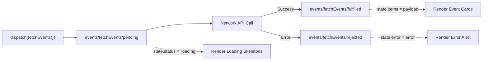

# ⏳ 11. Redux createAsyncThunk: Asynchronous State & Lifecycle

> **Git Branch:** `11-redux-async-thunk-events`  
> **Difficulty:** Advanced  
> **Prerequisites:** 10-redux-toolkit-store-and-cart-slice

---

## 🎯 The Problem: Asynchronous API Spaghetti in Components

In **Unit 3 (Branch 06)**, we fetched events inside a component-level `useEffect`:

```jsx
// 🔴 The Anti-Pattern: Component-Bound Asynchronous State
useEffect(() => {
  setLoading(true);
  fetch('/api/events')
    .then(res => res.json())
    .then(data => {
      setEvents(data);
      setLoading(false);
    })
    .catch(err => {
      setError(err.message);
      setLoading(false);
    });
}, []);
```

### Why this breaks down in real systems:
1. **No Shared Cache**: If the user navigates between the Event Catalog and an Event Details page, the exact same API endpoint is requested over and over again.
2. **Race Conditions**: If quick filter toggles fire overlapping network requests, slow responses can overwrite fresher responses.
3. **Scattered Loading/Error Logic**: Every component must reinvent its own `loading`, `error`, and `data` state flags.

---

## 🚀 The Solution: `createAsyncThunk`

Redux Toolkit includes `createAsyncThunk`, which standardizes asynchronous workflows. When you dispatch a thunk, RTK automatically dispatches three sequential actions representing the Promise lifecycle:



---

## 💻 Code Implementation (Branch 11)

### 1. Creating the Event Slice: `src/redux/slices/eventSlice.js`

```javascript
import { createSlice, createAsyncThunk } from '@reduxjs/toolkit';
import { initialEvents } from '../../data/events';

// Asynchronous Thunk to fetch events
export const fetchEvents = createAsyncThunk(
  'events/fetchEvents',
  async (_, { rejectWithValue }) => {
    try {
      // Simulate network latency (e.g. 500ms) for realistic loading transitions
      await new Promise((resolve) => setTimeout(resolve, 500));
      
      // In fullstack mode, fetch from '/api/events'; fallback to mock
      return initialEvents;
    } catch (error) {
      return rejectWithValue(error.message || 'Failed to load events');
    }
  }
);

const initialState = {
  items: [],
  status: 'idle', // 'idle' | 'loading' | 'succeeded' | 'failed'
  error: null,
  selectedCategory: 'ALL',
  searchQuery: '',
};

export const eventSlice = createSlice({
  name: 'events',
  initialState,
  reducers: {
    setSelectedCategory: (state, action) => {
      state.selectedCategory = action.payload;
    },
    setSearchQuery: (state, action) => {
      state.searchQuery = action.payload;
    },
  },
  extraReducers: (builder) => {
    builder
      .addCase(fetchEvents.pending, (state) => {
        state.status = 'loading';
        state.error = null;
      })
      .addCase(fetchEvents.fulfilled, (state, action) => {
        state.status = 'succeeded';
        state.items = action.payload;
      })
      .addCase(fetchEvents.rejected, (state, action) => {
        state.status = 'failed';
        state.error = action.payload;
      });
  },
});

export const { setSelectedCategory, setSearchQuery } = eventSlice.actions;

// Selectors
export const selectAllEvents = (state) => state.events.items;
export const selectEventStatus = (state) => state.events.status;
export const selectEventError = (state) => state.events.error;
export const selectSelectedCategory = (state) => state.events.selectedCategory;
export const selectSearchQuery = (state) => state.events.searchQuery;

// Memoized/Computed Selector
export const selectFilteredEvents = (state) => {
  const { items, selectedCategory, searchQuery } = state.events;
  return items.filter((event) => {
    const matchesCategory =
      selectedCategory === 'ALL' ||
      event.category?.toUpperCase() === selectedCategory.toUpperCase() ||
      event.department?.toUpperCase() === selectedCategory.toUpperCase();
    const matchesSearch =
      !searchQuery ||
      event.title?.toLowerCase().includes(searchQuery.toLowerCase()) ||
      event.description?.toLowerCase().includes(searchQuery.toLowerCase());
    return matchesCategory && matchesSearch;
  });
};

export default eventSlice.reducer;
```

### 2. Registering in the Store: `src/redux/store.js`

```javascript
import { configureStore } from '@reduxjs/toolkit';
import cartReducer from './slices/cartSlice';
import eventReducer from './slices/eventSlice';

export const store = configureStore({
  reducer: {
    cart: cartReducer,
    events: eventReducer,
  },
  devTools: process.env.NODE_ENV !== 'production',
});
```

### 3. Dispatching & Rendering in `src/pages/index.js`

```jsx
import { useEffect } from 'react';
import { useDispatch, useSelector } from 'react-redux';
import {
  fetchEvents,
  selectFilteredEvents,
  selectEventStatus,
} from '../redux/slices/eventSlice';
import EventCard from '../components/EventCard';
import LoadingSkeleton from '../components/LoadingSkeleton';

export default function HomePage() {
  const dispatch = useDispatch();
  const events = useSelector(selectFilteredEvents);
  const status = useSelector(selectEventStatus);

  useEffect(() => {
    if (status === 'idle') {
      dispatch(fetchEvents());
    }
  }, [status, dispatch]);

  return (
    <div className="min-h-screen bg-[#0a0f1d] text-slate-100">
      <main className="max-w-7xl mx-auto px-4 py-8">
        {status === 'loading' ? (
          <div className="grid grid-cols-1 md:grid-cols-2 lg:grid-cols-3 gap-6">
            {[1, 2, 3, 4, 5, 6].map((i) => (
              <LoadingSkeleton key={i} />
            ))}
          </div>
        ) : (
          <div className="grid grid-cols-1 md:grid-cols-2 lg:grid-cols-3 gap-6">
            {events.map((event) => (
              <EventCard key={event.id} event={event} />
            ))}
          </div>
        )}
      </main>
    </div>
  );
}
```

---

## 🎯 Summary

By encapsulating async logic within Redux `createAsyncThunk`:
1. The UI components stay 100% declarative and clean.
2. Data fetching lifecycle states (`idle`, `loading`, `succeeded`, `failed`) are standardized.
3. Multiple components can read cached event data without duplicate network calls.

**Next Step:** Let's inspect live action dispatches and make our state survive page reloads in **[12. Redux DevTools & Persistence](./12-redux-devtools-and-persistence.md)**!
