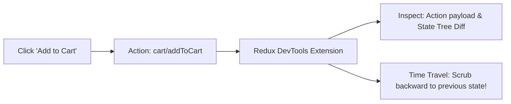

# ⏱️ 12. Redux DevTools & LocalStorage Persistence

> **Git Branch:** `12-redux-devtools-and-persistence`  
> **Difficulty:** Advanced  
> **Prerequisites:** 11-redux-async-thunk-events

---

## 🎯 The Two Production Requirements

In professional web applications, two capabilities make Redux indispensable:
1. **Developer Observability (Time-Travel Debugging)**:  
   Being able to inspect every dispatched action, see the exact diff of changed state, and replay or undo actions in real time.
2. **State Durability (Persistence)**:  
   When an attendee adds 3 fest workshops to their cart and refreshes the browser or closes the tab, **their cart must not disappear**!

---

## 🔍 Part 1: Time-Travel with Redux DevTools

When configuring the store via `configureStore()`, Redux Toolkit automatically enables the Redux DevTools extension in development mode (`devTools: process.env.NODE_ENV !== 'production'`).



### DevTools Superpowers:
1. **Diff Tab**: Visually highlights green (added) and red (removed) properties for every action.
2. **Action Tab**: Displays the exact payload sent by the component.
3. **Time-Travel Slider**: Drag the slider backward to test what your UI looks like before an action was fired!
4. **State Export/Import**: Export the exact state of a user's session to reproduce edge-case bugs in seconds.

---

## 💾 Part 2: Next.js-Safe State Persistence

Because Next.js runs both on the server (Node.js) and the client (Browser), we cannot access `window.localStorage` during server rendering. Doing so causes the infamous `ReferenceError: window is not defined`.

Here is the clean, production-grade persistence pattern using store subscribers:

### 1. Storage Helpers: `src/redux/localStorage.js`

```javascript
export const loadState = () => {
  try {
    // SSR Guard: localStorage only exists on the browser
    if (typeof window === 'undefined') return undefined;
    
    const serializedState = localStorage.getItem('kiot_fest_cart');
    if (serializedState === null) {
      return undefined;
    }
    return JSON.parse(serializedState);
  } catch (err) {
    console.warn('Could not load state from localStorage', err);
    return undefined;
  }
};

export const saveState = (state) => {
  try {
    if (typeof window === 'undefined') return;
    
    // Only persist the cart items (avoid persisting temporary drawer open state)
    const stateToPersist = {
      cart: {
        items: state.cart.items,
        isDrawerOpen: false,
      },
    };
    const serializedState = JSON.stringify(stateToPersist);
    localStorage.setItem('kiot_fest_cart', serializedState);
  } catch (err) {
    console.warn('Could not save state to localStorage', err);
  }
};
```

### 2. Hydrating and Subscribing in `src/redux/store.js`

```javascript
import { configureStore } from '@reduxjs/toolkit';
import cartReducer from './slices/cartSlice';
import eventReducer from './slices/eventSlice';
import { loadState, saveState } from './localStorage';

// 1. Load saved state from localStorage (or undefined if fresh/SSR)
const preloadedState = loadState();

export const store = configureStore({
  reducer: {
    cart: cartReducer,
    events: eventReducer,
  },
  preloadedState, // Hydrate state
  devTools: process.env.NODE_ENV !== 'production',
});

// 2. Subscribe to store updates with a debounce or direct save
store.subscribe(() => {
  saveState(store.getState());
});
```

---

## 🧪 Try It Yourself

1. Switch to branch `12-redux-devtools-and-persistence`:
   ```bash
   git checkout 12-redux-devtools-and-persistence
   npm run build
   npm run dev
   ```
2. Open Chrome DevTools and click the **Redux** tab.
3. Click **"Add to Cart"** on an event. Notice the `cart/addToCart` action appearing with its payload.
4. **Hard-refresh the browser (`Cmd + Shift + R` or `Ctrl + F5`)**:
   - Notice the cart badge retains its count!
   - Open `<CartDrawer />`: your chosen events are still there!

---

## 🏆 Unit 4 Milestone Achieved!

You have mastered state management from the ground up:
- ❌ **Avoided**: 4-tier Prop Drilling and brittle component chains.
- ❌ **Avoided**: Universal re-render penalties of monolithic Contexts.
- ✅ **Implemented**: Atomic RTK Slices, selective `useSelector` subscriptions, async lifecycle thunks, DevTools inspection, and automatic `localStorage` persistence!

**Next Unit:** Moving from pure client-side SPA to **Next.js Fullstack Architecture** in **Unit 5**!
