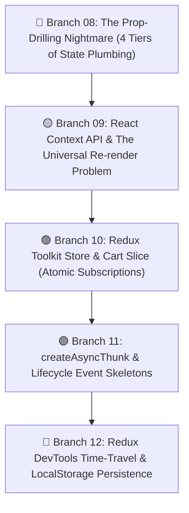
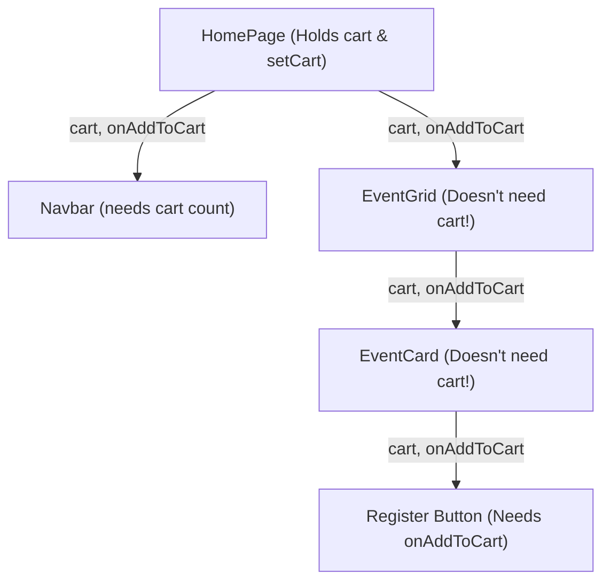
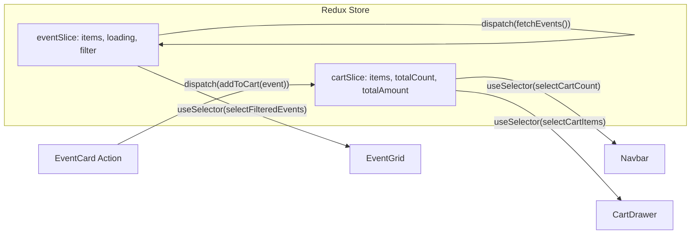

# 🗃️ Unit 4: Global State Management with Redux Toolkit

> **KIOT FEST 2026 — 2-Day College Fullstack Web Development Workshop**  
> **Target Audience:** 3rd-Year Computer Science & Engineering Students  
> **Session Time:** Day 2 (09:00 - 12:30)  
> **Core Philosophy:** *State should flow intuitively, be easily debugged, and never strangle your component architecture with unnecessary prop-chains.*

---

## 🎯 Unit 4 Overview

In **Unit 3**, we built our interactive React frontend for **KIOT Fest**. However, as our application grew from a single page into a multi-component, multi-route portal with event browsing, registration carts, filters, and dynamic details, we ran directly into a fundamental architectural crisis: **State Management Sprawl**.

When multiple components separated across completely different branches of the component tree need the exact same state (like the registration cart, attendee details, or active search filters), standard component-local `useState` forces us to "lift state up" to the root component and pass it through dozens of intermediary components that have no interest in the data.

Unit 4 is structured around **5 Progressive Steps & Git Branches** that demonstrate the evolution of state management in production web applications:



---

## 🗺️ Curriculum Roadmap & Branch Mapping

Every lesson directly maps to a working Git branch in this repository:

| # | Lesson Guide | Git Branch | Core Architecture Problem Solved |
| :--- | :--- | :--- | :--- |
| **08** | [08. Prop-Drilling Problem](./08-prop-drilling-problem.md) | `08-prop-drilling-problem` | **Prop-Drilling & Fragile Hierarchies**: Lifting state up to `HomePage` and threading `cart` and `onAddToCart` through 4 component layers (`HomePage` $\to$ `EventGrid` $\to$ `EventCard` $\to$ button; and to `Navbar`). |
| **09** | [09. useContext & Limitations](./09-usecontext-and-limitations.md) | `09-usecontext-and-limitations` | **Context API as a Partial Fix**: Eliminating prop-drilling with `CartContext`, but demonstrating why `useContext` causes all consumers to re-render whenever ANY context field changes. |
| **10** | [10. Redux Toolkit Store & Cart Slice](./10-redux-toolkit-store-and-cart-slice.md) | `10-redux-toolkit-store-and-cart-slice` | **Redux Toolkit Architecture**: Centralized Store, slice reducers, atomic `useSelector` subscriptions, and dispatching `addToCart` / `removeFromCart` actions with `<CartDrawer />`. |
| **11** | [11. createAsyncThunk & API Lifecycle](./11-redux-async-thunk-events.md) | `11-redux-async-thunk-events` | **Asynchronous Server State**: Replacing ad-hoc `useEffect` fetch loops with Redux `createAsyncThunk`, managing `pending`, `fulfilled`, and `rejected` states with loading skeletons. |
| **12** | [12. Redux DevTools & Persistence](./12-redux-devtools-and-persistence.md) | `12-redux-devtools-and-persistence` | **State Debugging & Durability**: Time-travel debugging with Redux DevTools, and automatic state hydration/persistence via `localStorage` middleware subscribers. |

---

## 🏗️ State Architecture Evolution

### 1. The Prop-Drilling Crisis (Branch 08)


### 2. The Redux Toolkit Solution (Branches 10 - 12)


---

## 🛠️ Quick Verification Commands

To switch to any branch and test it locally:

```bash
# Checkout branch
git checkout 08-prop-drilling-problem

# Install dependencies (if needed)
npm install

# Build production bundle
npm run build

# Start development server
npm run dev
```
