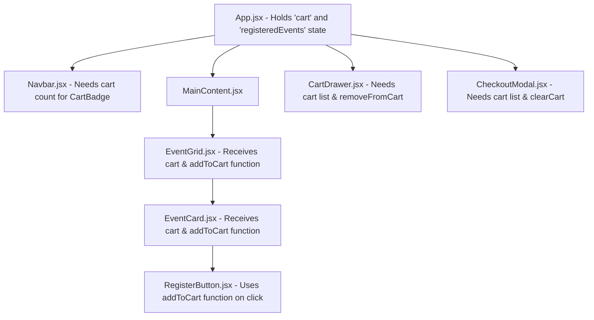
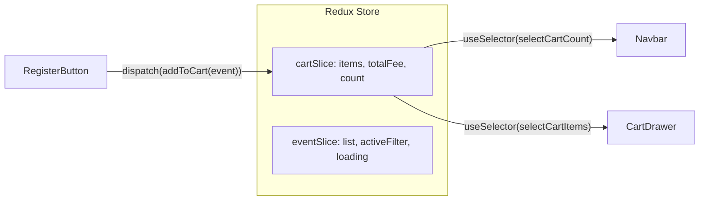

# Unit 4: Why Redux? Solving the Prop-Drilling Nightmare in KIOT Fest

## 1. The Real Problem in KIOT Fest

Imagine the component tree of our KIOT Fest website:

### The Pain Points:
1. **Prop Drilling**: `EventGrid` and `EventCard` don't actually care about the `cart` data—they are just forced to accept `cart` as a prop and pass it down one level further to `RegisterButton`.
2. **Brittle Code**: If you add a new intermediary wrapper (e.g. `FilterLayout`), you must update props across 5 files.
3. **Multi-Page Sync**: In a multi-page app with React Router (`/events`, `/events/:id`, `/my-tickets`), navigating away unmounts components, losing component-local state unless lifted all the way to `App` or localStorage.

---

## 2. Why Not Just `useContext` for Everything?

| Feature | React Context API | Redux Toolkit (RTK) |
| :--- | :--- | :--- |
| **Best For** | Low-frequency updates (Theme: Dark/Light, Auth User Info, Language). | Frequent, multi-source state updates (Cart, Event Filters, Async Fetching, Live Counters). |
| **Re-render Performance** | Every component consuming the context re-renders whenever ANY value in the context changes. | **Fine-grained Selectors**: Components re-render *only* if the exact sliced data they subscribed to changes via `useSelector`. |
| **Async Handling** | Requires manual `useEffect` + boilerplate for pending/fulfilled/rejected states. | Built-in `createAsyncThunk` handles async lifecycle cleanly. |
| **Time-Travel Debugging** | None out of the box. | **Redux DevTools**: Step forward and backward through every action dispatched! |

---

## 3. The Redux Solution for KIOT Fest

With Redux Toolkit, the state lives in a centralized **Store**. Any component can read or update state directly without troubling parent components:

