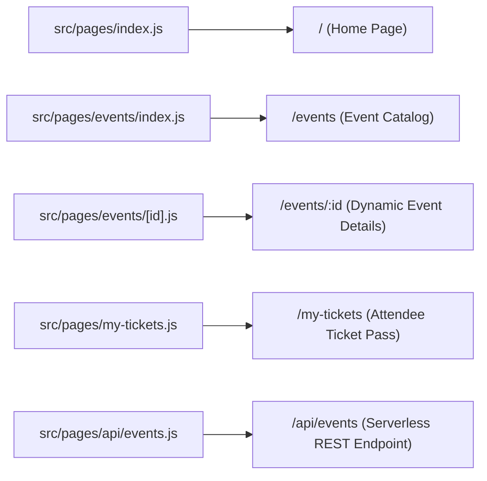

# 📁 13. Next.js Architecture & File-Based Routing

> **Git Branch:** `13-nextjs-setup-file-routing`  
> **Difficulty:** Intermediate  
> **Prerequisites:** Unit 4 (Redux Toolkit)

---

## 🎯 Why Next.js Over Plain React (CRA / Vite)?

In standard client-side React apps, configuring multi-page routing requires installing external libraries (`react-router-dom`), configuring complicated `<Routes>` and `<Route>` wrappers, and managing 404 fallbacks manually.

**Next.js introduces File-System Based Routing**:  
Every file created inside the `src/pages/` directory automatically becomes a public URL route in your web application!



---

## 💻 Code Implementation (Branch 13)

### 1. Customizing HTML Shell: `src/pages/_document.js`
Next.js gives us direct control over the `<html>`, `<head>`, and `<body>` tags via `_document.js`. Here we inject Google Fonts (`Outfit` & `Inter`) and set our dark background color:

```jsx
import { Html, Head, Main, NextScript } from 'next/document';

export default function Document() {
  return (
    <Html lang="en" className="dark">
      <Head>
        <link rel="preconnect" href="https://fonts.googleapis.com" />
        <link rel="preconnect" href="https://fonts.gstatic.com" crossOrigin="anonymous" />
        <link
          href="https://fonts.googleapis.com/css2?family=Inter:wght@300;400;500;600;700&family=Outfit:wght@500;600;700;800;900&display=swap"
          rel="stylesheet"
        />
      </Head>
      <body className="bg-[#0a0f1d] text-slate-100 font-sans antialiased min-h-screen selection:bg-indigo-500 selection:text-white">
        <Main />
        <NextScript />
      </body>
    </Html>
  );
}
```

### 2. Dynamic Route with `useRouter`: `src/pages/events/[id].js`
The filename `[id].js` signals to Next.js that `id` is a dynamic route parameter:

```jsx
import { useRouter } from 'next/router';
import Link from 'next/link';
import Navbar from '../../components/Navbar';
import Footer from '../../components/Footer';
import { initialEvents } from '../../data/events';

export default function EventDetailsPage() {
  const router = useRouter();
  const { id } = router.query;

  // Find event matching query ID
  const event = initialEvents.find((e) => e.id === id);

  if (!event) {
    return (
      <div className="min-h-screen bg-[#0a0f1d] text-white flex flex-col justify-between">
        <Navbar />
        <div className="text-center py-20">
          <h2 className="text-2xl font-bold">Event Not Found</h2>
          <Link href="/events" className="mt-4 inline-block text-indigo-400 underline">
            Back to Catalog
          </Link>
        </div>
        <Footer />
      </div>
    );
  }

  return (
    <div className="min-h-screen bg-[#0a0f1d] text-slate-100 flex flex-col justify-between">
      <Navbar />
      
      <main className="max-w-4xl mx-auto px-4 py-12 flex-1">
        <Link href="/events" className="text-sm font-medium text-slate-400 hover:text-white flex items-center gap-2 mb-6">
          ← Back to All Events
        </Link>

        <div className="bg-slate-900/80 border border-slate-800 rounded-3xl p-8 backdrop-blur-xl">
          <div className="flex flex-wrap items-center justify-between gap-4">
            <span className="px-3 py-1 rounded-full text-xs font-semibold bg-indigo-500/10 text-indigo-400 border border-indigo-500/20">
              {event.department}
            </span>
            <span className="text-xl font-bold text-amber-400">
              {event.registrationFee === 0 ? 'FREE' : `₹${event.registrationFee}`}
            </span>
          </div>

          <h1 className="text-3xl md:text-4xl font-extrabold text-white mt-4 font-outfit">
            {event.title}
          </h1>

          <p className="text-slate-300 text-lg mt-4 leading-relaxed">
            {event.description}
          </p>

          <div className="mt-8 grid grid-cols-1 md:grid-cols-2 gap-4 border-t border-slate-800/80 pt-6">
            <div>
              <span className="text-xs uppercase tracking-wider text-slate-500 font-bold">Venue</span>
              <p className="text-white font-medium mt-1">📍 {event.venue || 'KIOT Campus Hall A'}</p>
            </div>
            <div>
              <span className="text-xs uppercase tracking-wider text-slate-500 font-bold">Schedule</span>
              <p className="text-white font-medium mt-1">🗓️ {event.date || 'March 20, 2026'}</p>
            </div>
          </div>
        </div>
      </main>

      <Footer />
    </div>
  );
}
```

### 3. Fast Transitions with `next/link`
Instead of standard `<a href="...">` (which forces a full browser reload), use Next.js `<Link href="...">` to perform **instant client-side transitions** while prefetching linked routes in the background!

```jsx
import Link from 'next/link';

<Link 
  href={`/events/${event.id}`}
  className="text-sm font-semibold text-indigo-400 hover:text-indigo-300"
>
  View Details →
</Link>
```

---

## 🧪 Verification Check

1. Checkout branch `13-nextjs-setup-file-routing`:
   ```bash
   git checkout 13-nextjs-setup-file-routing
   npm run dev
   ```
2. Navigate to `http://localhost:3000/events`.
3. Click any event to navigate to `http://localhost:3000/events/ev-1`.
4. Check the browser Network tab: Note that page switches take < 50ms and do **not** trigger a full-page document reload!

**Next Step:** Pre-rendering pages for blazing speed and SEO in **[14. SSG, ISR & SSR Data Fetching](./14-nextjs-ssg-and-ssr.md)**!
