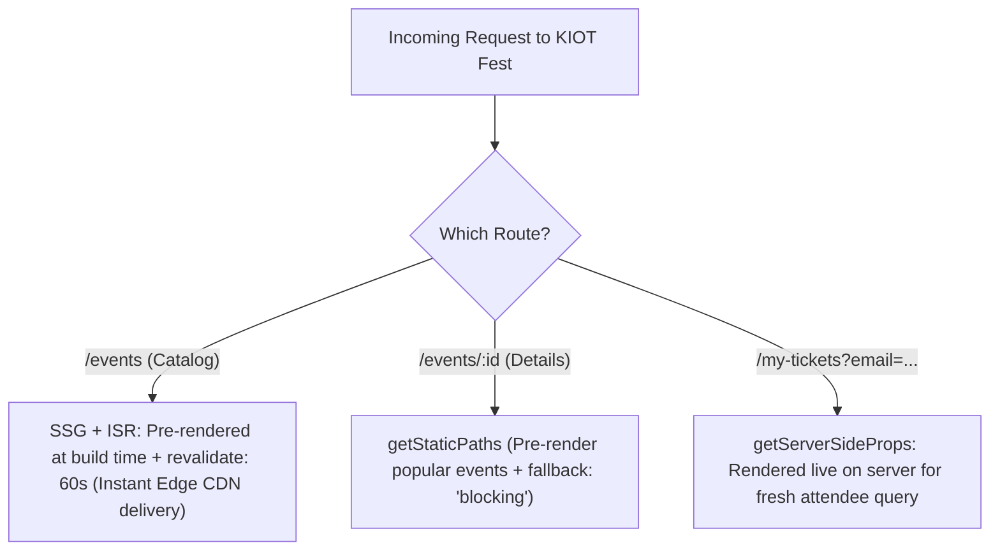

# 🏎️ 14. Next.js Data Fetching: SSG, ISR & SSR Explained

> **Git Branch:** `14-nextjs-ssg-and-ssr`  
> **Difficulty:** Advanced  
> **Prerequisites:** 13-nextjs-setup-file-routing

---

## 🎯 The Rendering Spectrum

One of Next.js's greatest superpowers is giving developers the freedom to choose the **exact rendering strategy** on a per-page basis:



| Strategy | Function | When It Runs | Best Used For |
| :--- | :--- | :--- | :--- |
| **SSG** (Static Site Gen) | `getStaticProps` | At build time (`npm run build`) | Static catalogs, marketing pages, blogs. |
| **ISR** (Incremental Static Regen) | `getStaticProps` with `revalidate` | At build time + regenerated in background every $N$ seconds | High-traffic event listings that change periodically. |
| **SSR** (Server-Side Rendering) | `getServerSideProps` | On **every** incoming request | User dashboards, dynamic search queries, personalized passes. |

---

## 💻 Code Implementation (Branch 14)

### 1. SSG with ISR on Event Catalog: `src/pages/events/index.js`
When building the site, Next.js executes `getStaticProps` on the server and renders static HTML and JSON. When users visit `/events`, HTML is served in **< 20ms** from the edge cache:

```jsx
import { mockEvents } from '../../lib/mockData';
import EventCard from '../../components/EventCard';
import Navbar from '../../components/Navbar';
import Footer from '../../components/Footer';

export default function EventsCatalogPage({ events, lastGenerated }) {
  return (
    <div className="min-h-screen bg-[#0a0f1d] text-slate-100 flex flex-col justify-between">
      <Navbar />
      <main className="max-w-7xl mx-auto px-4 py-12 flex-1">
        <div className="flex flex-wrap items-center justify-between gap-4 mb-8">
          <div>
            <h1 className="text-3xl font-extrabold text-white">Event Catalog</h1>
            <p className="text-slate-400 text-sm mt-1">
              Static pre-rendered page — Generated at: {new Date(lastGenerated).toLocaleTimeString()}
            </p>
          </div>
        </div>

        <div className="grid grid-cols-1 md:grid-cols-2 lg:grid-cols-3 gap-6">
          {events.map((event) => (
            <EventCard key={event.id} event={event} />
          ))}
        </div>
      </main>
      <Footer />
    </div>
  );
}

// Executed at build time on the server!
export async function getStaticProps() {
  // In a full production setup, fetch from DB or CMS
  const events = mockEvents;

  return {
    props: {
      events,
      lastGenerated: new Date().toISOString(),
    },
    // ISR: Next.js will attempt to regenerate this page in background if requested after 60s
    revalidate: 60,
  };
}
```

### 2. `getStaticPaths` on Dynamic Details: `src/pages/events/[id].js`
To pre-render dynamic routes like `/events/ev-1`, Next.js must know which IDs exist at build time:

```jsx
import { mockEvents } from '../../lib/mockData';

export async function getStaticPaths() {
  const paths = mockEvents.map((event) => ({
    params: { id: event.id },
  }));

  return {
    paths,
    // 'blocking': If a new event is added after build, render server-side on first request, then cache statically!
    fallback: 'blocking',
  };
}

export async function getStaticProps({ params }) {
  const event = mockEvents.find((e) => e.id === params.id) || null;

  if (!event) {
    return { notFound: true };
  }

  return {
    props: {
      event,
    },
    revalidate: 60,
  };
}
```

### 3. `getServerSideProps` for Dynamic Ticket Lookup: `src/pages/my-tickets.js`
When an attendee looks up their tickets by email query (`/my-tickets?email=student@kiot.ac.in`), we use `getServerSideProps` to fetch fresh registrations on the server before sending the page down:

```jsx
export async function getServerSideProps(context) {
  const { email = '' } = context.query;
  
  // Query registration records for this specific attendee
  return {
    props: {
      initialEmail: email,
    },
  };
}
```

---

## ⚡ Performance Difference: CSR vs. SSG

| Metric | Client-Side SPA (Unit 3) | Next.js SSG / ISR (Unit 5) |
| :--- | :--- | :--- |
| **First Contentful Paint (FCP)** | 1.8s - 3.2s (Requires JS bundle download & execution) | **0.3s - 0.6s** (Pure static HTML delivered instantly) |
| **Search Engine Crawling (SEO)** | Poor (Bots often see an empty `<div id="root">`) | **Flawless** (Search engines read complete HTML & metadata) |
| **Server Load Under Spike** | Zero (Client fetches API) | **Zero to Minimal** (CDN edge caches pre-rendered HTML) |

**Next Step:** Building fullstack serverless APIs and connecting our database in **[15. API Routes & Dual-Mode MySQL Driver](./15-nextjs-api-and-mysql.md)**!
