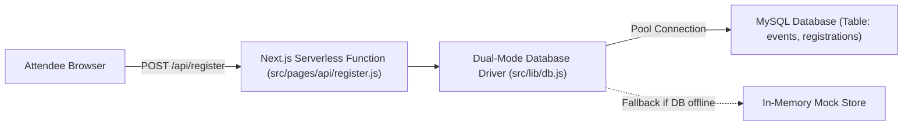

# 🗄️ 15. Next.js API Routes & Resilient Dual-Mode Database Architecture

> **Git Branch:** `15-nextjs-api-and-mysql`  
> **Difficulty:** Advanced  
> **Prerequisites:** 14-nextjs-ssg-and-ssr

---

## 🎯 Next.js as a Backend: API Routes

In traditional setups, frontend developers had to configure a separate Express or Spring Boot server to handle backend logic and database operations.

**Next.js includes Serverless API Routes natively**:  
Any file inside `src/pages/api/` executes solely in a secure Node.js server environment and is exposed as an HTTP endpoint:



---

## 🛡️ The Resilient Dual-Mode Database Driver (`src/lib/db.js`)

In college classrooms and production environments alike, database connectivity can be volatile:
- A student's laptop might not have MySQL installed.
- A cloud database might temporarily time out.
- During build time (`npm run build`), a running database might not even be accessible.

Our architectural solution is a **Dual-Mode Resilient Database Driver**:
1. It attempts to connect to a real MySQL connection pool using `mysql2/promise`.
2. If MySQL credentials are missing or the server connection fails, it **automatically falls back to an in-memory mock dataset** without crashing the build or throwing unhandled exceptions!

### Driver Implementation: `src/lib/db.js`

```javascript
import mysql from 'mysql2/promise';
import { mockEvents, mockRegistrations } from './mockData';

let pool = null;

// Initialize connection pool if environment variables are provided
if (process.env.DB_HOST || process.env.MYSQL_HOST) {
  try {
    pool = mysql.createPool({
      host: process.env.DB_HOST || process.env.MYSQL_HOST || 'localhost',
      user: process.env.DB_USER || process.env.MYSQL_USER || 'root',
      password: process.env.DB_PASSWORD || process.env.MYSQL_PASSWORD || '',
      database: process.env.DB_NAME || process.env.MYSQL_DATABASE || 'kiot_fest',
      waitForConnections: true,
      connectionLimit: 10,
      queueLimit: 0,
    });
  } catch (err) {
    console.warn('⚠️ MySQL pool initialization failed. Falling back to Mock DB mode.', err.message);
    pool = null;
  }
}

// Resilient query wrapper
export async function query(sql, params = []) {
  if (pool) {
    try {
      const [results] = await pool.execute(sql, params);
      return results;
    } catch (err) {
      console.warn('⚠️ MySQL query failed, using mock data fallback:', err.message);
    }
  }

  // Graceful Mock Fallbacks
  const normalized = sql.trim().toUpperCase();

  if (normalized.startsWith('SELECT * FROM EVENTS')) {
    return mockEvents;
  }

  if (normalized.includes('FROM REGISTRATIONS')) {
    if (params.length > 0) {
      const email = params[0];
      return mockRegistrations.filter((r) => r.email?.toLowerCase() === email?.toLowerCase());
    }
    return mockRegistrations;
  }

  if (normalized.startsWith('INSERT INTO REGISTRATIONS')) {
    const newId = `reg-${Date.now()}`;
    const newRecord = { id: newId, params };
    mockRegistrations.push(newRecord);
    return { insertId: newId, affectedRows: 1 };
  }

  return [];
}
```

---

## 💻 Fullstack Endpoint Implementations

### 1. Event Listing Endpoint: `src/pages/api/events.js`

```javascript
import { query } from '../../lib/db';

export default async function handler(req, res) {
  if (req.method !== 'GET') {
    return res.status(405).json({ message: 'Method Not Allowed' });
  }

  try {
    const events = await query('SELECT * FROM events ORDER BY date ASC');
    res.status(200).json(events);
  } catch (error) {
    res.status(500).json({ message: 'Error querying events', error: error.message });
  }
}
```

### 2. Fest Registration Endpoint: `src/pages/api/register.js`

```javascript
import { query } from '../../lib/db';

export default async function handler(req, res) {
  if (req.method !== 'POST') {
    return res.status(405).json({ message: 'Method Not Allowed' });
  }

  const { studentName, email, college, phone, eventIds } = req.body;

  if (!studentName || !email || !eventIds || !eventIds.length) {
    return res.status(400).json({ message: 'Missing required registration fields' });
  }

  try {
    const registrationId = `reg-${Date.now()}`;
    
    // Insert record into registrations table
    await query(
      'INSERT INTO registrations (id, student_name, email, college, phone, event_ids, created_at) VALUES (?, ?, ?, ?, ?, ?, NOW())',
      [registrationId, studentName, email, college || 'KIOT', phone || '', JSON.stringify(eventIds)]
    );

    res.status(201).json({
      success: true,
      message: 'Registration successful!',
      registrationId,
      attendee: { studentName, email },
    });
  } catch (error) {
    res.status(500).json({ message: 'Database registration failed', error: error.message });
  }
}
```

---

## 🧪 Testing the Endpoints Locally

Start the development server:
```bash
npm run dev
```

Test with `curl` or Postman:

```bash
# 1. Fetch all events
curl http://localhost:3000/api/events

# 2. Register for an event
curl -X POST http://localhost:3000/api/register \
  -H "Content-Type: application/json" \
  -d '{"studentName":"Arun Kumar","email":"arun@kiot.ac.in","college":"KIOT","eventIds":["ev-1"]}'
```

**Next Step:** Making our application look stunning and work seamlessly on iPhones, Androids, Safari, and Chrome in **[16. Cross-Device & Browser Compatibility](./16-cross-device-and-browser-compatibility.md)**!
