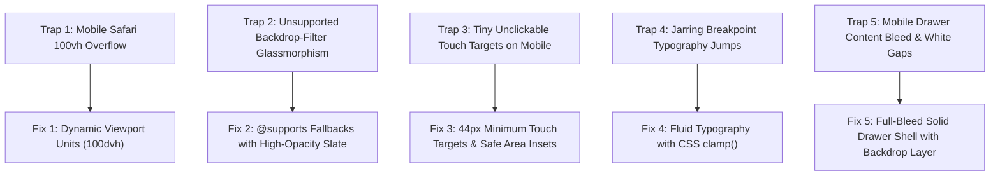

# 📱 16. Cross-Device & Browser Compatibility: Engineering for the Real World

> **Git Branch:** `16-cross-device-and-browser-compatibility`  
> **Difficulty:** Advanced  
> **Prerequisites:** 15-nextjs-api-and-mysql

---

## 🎯 The Reality of College Fest Traffic

During KIOT Fest, over **85% of attendees access the portal directly from their mobile smartphones** (iPhones running iOS Safari, Samsung & OnePlus running Chrome/Edge, and low-end Androids).

If an app only looks good on the developer's 16-inch MacBook screen, it will fail in production. Here are the 5 major cross-device traps and how we engineered fixes for them:



---

## 🛠️ Cross-Device Solutions Implemented

### 1. Dynamic Viewport Heights (`100dvh` vs `100vh`)
On mobile browsers (especially iOS Safari and Chrome Android), the browser address bar shrinks and expands as the user scrolls.  
- Using `height: 100vh` causes bottom buttons and drawers to be hidden behind the browser's bottom navigation bar!
- **The Modern Solution**: Use dynamic viewport units `100dvh` (Dynamic Viewport Height):

```css
/* Fallback for older browsers, progressive enhancement for modern browsers */
.screen-container {
  min-height: 100vh;
  min-height: 100dvh;
}
```

### 2. Glassmorphism with `@supports` Progressive Enhancement
Glassmorphism looks gorgeous, but if an older browser or Firefox battery-saver mode disables `backdrop-filter`, standard semi-transparent backgrounds become illegible:

```css
/* Solid fallback for unsupporting browsers */
.glass-panel {
  background-color: rgba(15, 23, 42, 0.95); /* High-contrast solid slate */
}

/* Enhanced blur for modern browsers */
@supports ((-webkit-backdrop-filter: blur(16px)) or (backdrop-filter: blur(16px))) {
  .glass-panel {
    background-color: rgba(15, 23, 42, 0.75);
    -webkit-backdrop-filter: blur(16px);
    backdrop-filter: blur(16px);
  }
}
```

### 3. Fluid Typography with CSS `clamp()`
Instead of writing clumsy media queries for every phone size, CSS `clamp(min, preferred, max)` scales text smoothly according to the viewport width:

```css
/* Hero Title: Min 2rem (32px), Preferred 5vw + 1rem, Max 3.75rem (60px) */
.hero-title {
  font-size: clamp(2rem, 5vw + 1rem, 3.75rem);
  line-height: 1.15;
}

/* Event Card Title: Scales cleanly between phone and desktop */
.card-title {
  font-size: clamp(1.125rem, 2vw + 0.5rem, 1.5rem);
}
```

### 4. Fully-Contained Mobile Drawer in `Navbar.jsx`
To prevent content behind a mobile navigation drawer from peeking through or causing horizontal scrolling:
1. Lock background scrolling when drawer is open (`overflow-hidden`).
2. Give the drawer panel a solid background (`bg-slate-900` or `bg-[#0a0f1d]`) with `min-h-[100dvh]`.
3. Use a separate darkened overlay for the backdrop blur.

```jsx
{/* Mobile Drawer */}
<div 
  id="mobile-drawer"
  className={`fixed inset-y-0 right-0 z-50 w-full max-w-xs bg-slate-900 border-l border-slate-800 shadow-2xl p-6 transition-transform duration-300 ease-in-out ${
    isMobileMenuOpen ? 'translate-x-0' : 'translate-x-full'
  }`}
>
  {/* Drawer header with close button */}
  <div className="flex items-center justify-between pb-6 border-b border-slate-800">
    <span className="font-bold text-lg text-white">Menu</span>
    <button
      onClick={() => setIsMobileMenuOpen(false)}
      className="p-2 rounded-xl text-slate-400 hover:text-white"
    >
      ✕
    </button>
  </div>
  
  {/* Full-width touch-friendly navigation links */}
  <nav className="flex flex-col gap-2 mt-6">
    <Link href="/events" className="p-3 text-base font-semibold text-slate-200 hover:bg-slate-800/60 rounded-xl">
      Event Catalog
    </Link>
    <Link href="/my-tickets" className="p-3 text-base font-semibold text-slate-200 hover:bg-slate-800/60 rounded-xl">
      My Tickets
    </Link>
  </nav>
</div>
```

---

## 🧪 Device Emulation Verification

1. Switch to branch `16-cross-device-and-browser-compatibility`:
   ```bash
   git checkout 16-cross-device-and-browser-compatibility
   npm run dev
   ```
2. Open Chrome DevTools (`Cmd + Option + I` or `F12`) and toggle **Device Toolbar** (`Cmd + Shift + M`).
3. Select **iPhone 14 Pro Max** and then switch to **Samsung Galaxy S20 Ultra**.
4. Test:
   - Does opening the mobile menu fully cover the right edge without visual gaps?
   - Is all text easily readable without horizontal scrolling?
   - Are touch buttons comfortably clickable?

**Next Step:** High-resolution digital QR passes and social share previews in **[17. Image Optimization, QR Tickets & SEO](./17-image-optimization-and-seo.md)**!
