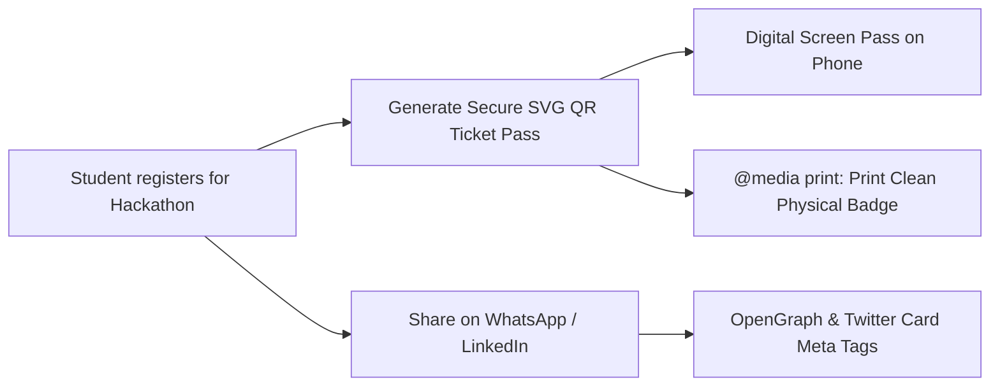

# 🎫 17. Image Optimization, QR Ticket Passes & SEO Meta Tags

> **Git Branch:** `17-image-optimization-and-seo`  
> **Difficulty:** Advanced  
> **Prerequisites:** 16-cross-device-and-browser-compatibility

---

## 🎯 Transforming an App into a Shareable, Physical Experience

A college fest portal needs two vital real-world capabilities:
1. **Viral Sharing & SEO**: When a student copies the fest link into a college WhatsApp group, it must display an attractive banner preview, title, and date—not a generic blank URL.
2. **Offline Verified Passes**: Attendees arriving at the college registration desk need an official entry pass with a verifiable QR code that looks great on their phone screen **and** prints cleanly onto paper.



---

## 💻 Code Implementation (Branch 17)

### 1. Dynamic OpenGraph SEO Tags: `src/pages/events/[id].js`
Using Next.js `<Head>`, we inject social graph metadata dynamically per event:

```jsx
import Head from 'next/head';

export default function EventDetailsPage({ event }) {
  const pageTitle = `${event.title} | KIOT Fest 2026`;
  const pageDescription = event.description.slice(0, 150) + '...';
  const siteUrl = 'https://kiot-fest.vercel.app';
  const ogImageUrl = `${siteUrl}/images/og-banner.jpg`;

  return (
    <>
      <Head>
        <title>{pageTitle}</title>
        <meta name="description" content={pageDescription} />

        {/* OpenGraph / WhatsApp / Facebook */}
        <meta property="og:type" content="website" />
        <meta property="og:title" content={pageTitle} />
        <meta property="og:description" content={pageDescription} />
        <meta property="og:image" content={ogImageUrl} />

        {/* Twitter Card */}
        <meta name="twitter:card" content="summary_large_image" />
        <meta name="twitter:title" content={pageTitle} />
        <meta name="twitter:description" content={pageDescription} />
        <meta name="twitter:image" content={ogImageUrl} />
      </Head>

      {/* Rest of the page */}
    </>
  );
}
```

### 2. Digital QR Fest Pass Component: `src/components/TicketPass.jsx`
Generates a crisp, scalable vector QR code and ticket layout:

```jsx
export default function TicketPass({ ticket }) {
  // Generate encoded verification payload
  const qrPayload = encodeURIComponent(
    JSON.stringify({
      id: ticket.id,
      attendee: ticket.studentName,
      event: ticket.eventTitle,
      college: ticket.college,
    })
  );

  return (
    <div className="ticket-card bg-slate-900 border border-slate-700/80 rounded-3xl p-8 max-w-md mx-auto shadow-2xl relative overflow-hidden">
      {/* Fest Header */}
      <div className="flex items-center justify-between border-b border-slate-800 pb-4">
        <div>
          <span className="text-xs font-bold uppercase tracking-widest text-indigo-400">Official Pass</span>
          <h2 className="text-xl font-extrabold text-white">KIOT FEST 2026</h2>
        </div>
        <span className="px-3 py-1 rounded-full text-xs font-bold bg-amber-400/10 text-amber-300 border border-amber-400/20">
          CONFIRMED
        </span>
      </div>

      {/* Ticket Details */}
      <div className="my-6 space-y-3">
        <div>
          <span className="text-xs text-slate-500 font-semibold uppercase">Attendee</span>
          <p className="text-lg font-bold text-white">{ticket.studentName}</p>
        </div>
        <div className="flex justify-between">
          <div>
            <span className="text-xs text-slate-500 font-semibold uppercase">Event</span>
            <p className="text-white font-medium">{ticket.eventTitle}</p>
          </div>
          <div className="text-right">
            <span className="text-xs text-slate-500 font-semibold uppercase">Pass ID</span>
            <p className="text-indigo-400 font-mono text-sm">{ticket.id}</p>
          </div>
        </div>
      </div>

      {/* SVG QR Code */}
      <div className="bg-white p-4 rounded-2xl flex flex-col items-center justify-center mx-auto w-48 h-48 shadow-inner">
        
      </div>
      <p className="text-center text-xs text-slate-400 mt-4">
        Scan at Campus Gate A for entry validation
      </p>

      {/* Print Action */}
      <div className="mt-6 text-center no-print">
        <button
          onClick={() => window.print()}
          className="px-6 py-2.5 rounded-xl font-semibold bg-indigo-600 hover:bg-indigo-500 text-white shadow-lg transition-all"
        >
          🖨️ Print Ticket Pass
        </button>
      </div>
    </div>
  );
}
```

### 3. Print-Ready CSS: `@media print`
When printed, dark themes waste ink and look messy. With print stylesheets, we hide all navigation buttons and render clean black text on white paper:

```css
@media print {
  /* Hide interactive controls and chrome */
  header, footer, nav, .no-print, button {
    display: none !important;
  }

  /* Invert styling for clean ink-saving paper print */
  body {
    background: #ffffff !important;
    color: #000000 !important;
  }

  .ticket-card {
    border: 2px dashed #000000 !important;
    background: #ffffff !important;
    color: #000000 !important;
    box-shadow: none !important;
    page-break-inside: avoid;
  }

  .ticket-card * {
    color: #000000 !important;
  }
}
```

---

## 🧪 Verification Check

1. Switch to branch `17-image-optimization-and-seo`:
   ```bash
   git checkout 17-image-optimization-and-seo
   npm run dev
   ```
2. Navigate to `http://localhost:3000/my-tickets`.
3. View the generated ticket pass with the dynamic QR code.
4. Press `Cmd + P` (or `Ctrl + P`) to open Print Preview:
   - Notice the dark background disappears!
   - The ticket pass renders cleanly as a physical paper badge!

**Next Step:** Deploying to the cloud and running an administrative dashboard in **[18. Final Project & Vercel Deployment](./18-final-project-and-vercel-deploy.md)**!
