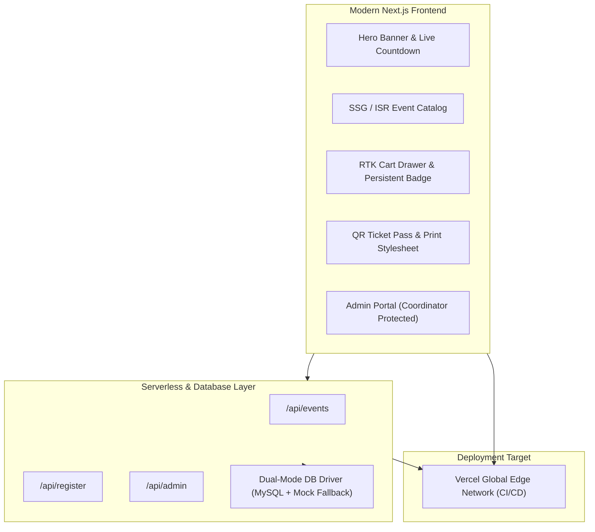

# 🚀 18. Final Project, Admin Dashboard & Vercel Cloud Deployment

> **Git Branch:** `18-final-project-and-vercel-deploy`  
> **Difficulty:** Capstone Project  
> **Prerequisites:** 17-image-optimization-and-seo

---

## 🏆 The Complete KIOT Fest Fullstack System

Congratulations! Over these 2 intensive workshop days, you progressed through the complete modern web development stack:
- **Unit 0 & 1**: HTML semantics, CSS flex/grid layout, modern ES6+ JS engine.
- **Unit 2**: Design thinking, UI kits, and interactive prototyping in Figma.
- **Unit 3**: Component hierarchy, reactive state (`useState`), controlled forms, and API lifecycle.
- **Unit 4**: Global state management with Redux Toolkit, atomic slices, async thunks, and local storage persistence.
- **Unit 5**: Next.js fullstack SSR/SSG rendering, resilient database connectivity, QR ticket passes, and responsive design.



---

## 🛡️ Admin Dashboard & Auth Guard

Branch 18 introduces administrative controls so fest coordinators can manage events:

### Protected Coordinator Routes: `src/pages/admin.js`
Uses our Redux `authSlice` to ensure only logged-in student coordinators can add, edit, or delete events:

```jsx
import { useEffect } from 'react';
import { useRouter } from 'next/router';
import { useSelector } from 'react-redux';
import { selectIsAuthenticated, selectCurrentUser } from '../redux/slices/authSlice';
import Navbar from '../components/Navbar';
import Footer from '../components/Footer';

export default function AdminDashboardPage() {
  const router = useRouter();
  const isAuthenticated = useSelector(selectIsAuthenticated);
  const user = useSelector(selectCurrentUser);

  useEffect(() => {
    if (!isAuthenticated) {
      router.push('/login');
    }
  }, [isAuthenticated, router]);

  if (!isAuthenticated) return null;

  return (
    <div className="min-h-screen bg-[#0a0f1d] text-slate-100 flex flex-col justify-between">
      <Navbar />
      <main className="max-w-7xl mx-auto px-4 py-12 flex-1">
        <h1 className="text-3xl font-extrabold text-white">Coordinator Portal</h1>
        <p className="text-slate-400 mt-2">Welcome back, {user?.name || 'Coordinator'}</p>
        
        {/* Event Management Table & Controls */}
      </main>
      <Footer />
    </div>
  );
}
```

---

## 🚢 Deploying to Vercel in 3 Steps

Vercel is the creator of Next.js and the premier hosting platform for modern web applications.

### Step 1: Push Code to GitHub
Ensure all your branch commits are pushed to your personal or organization repository:
```bash
git push origin 18-final-project-and-vercel-deploy
```

### Step 2: Import into Vercel
1. Navigate to [vercel.com](https://vercel.com) and log in with your GitHub account.
2. Click **"Add New..."** $\to$ **"Project"**.
3. Select your `kiot_fest` repository and choose the `18-final-project-and-vercel-deploy` branch.
4. Next.js is automatically detected!

### Step 3: Configure Environment Variables (Optional)
If connecting to a remote MySQL database (e.g. PlanetScale, Supabase, or AWS RDS):
- `DB_HOST`: Your cloud database host
- `DB_USER`: Database username
- `DB_PASSWORD`: Database password
- `DB_NAME`: `kiot_fest`

> **Note on Resiliency:** If you do not provide database credentials, our resilient `lib/db.js` driver will seamlessly fall back to mock data mode. Your live Vercel URL will work instantly out of the box!

Click **"Deploy"**! In less than 60 seconds, your college fest portal is live with a global HTTPS domain!

---

## 🎓 Next Steps in Your Software Engineering Journey

1. **Add Real Payment Gateway**: Integrate Razorpay or Stripe into `/api/checkout`.
2. **Real-time Attendance Scanner**: Build a mobile QR scanner using the HTML5 Camera API (`getUserMedia`) for gate volunteers.
3. **Database Migration**: Deploy a cloud PostgreSQL or PlanetScale MySQL instance.
4. **Star & Share**: Add this project to your GitHub portfolio and showcase your fullstack skills on LinkedIn!

Congratulations on completing the **KIOT Fest 2026 Web Development Workshop**! 🚀
