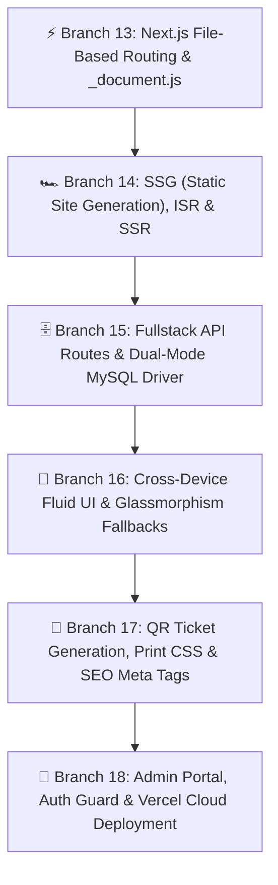
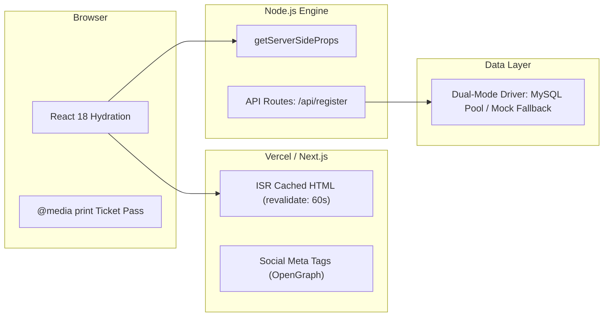

# ⚡ Unit 5: Next.js Fullstack Architecture, Cross-Device Compatibility & Production Deployment

> **KIOT FEST 2026 — 2-Day College Fullstack Web Development Workshop**  
> **Target Audience:** 3rd-Year Computer Science & Engineering Students  
> **Session Time:** Day 2 (13:30 - 17:30)  
> **Core Philosophy:** *A modern web application is not just a client-side bundle—it is a fullstack system that renders with blazing speed, adapts across every device and browser, and scales to thousands of concurrent users.*

---

## 🎯 Unit 5 Overview

In **Units 3 & 4**, we mastered React and Redux Toolkit. However, client-side SPAs have significant limitations in real-world college fests:
- **Blank white screens on slow college 4G networks** while the JavaScript bundle downloads.
- **Zero SEO / social sharing previews** on WhatsApp, LinkedIn, and Instagram.
- **Lack of secure server-side logic** to connect to real databases (MySQL) and handle payments/tickets.

**Unit 5** transforms KIOT Fest into a production-grade **Fullstack Web Application** powered by **Next.js**:

---

## 🗺️ Curriculum Roadmap & Branch Mapping

| # | Lesson Guide | Git Branch | Core Production Problem Solved |
| :--- | :--- | :--- | :--- |
| **13** | [13. Next.js Setup & File-Based Routing](./13-nextjs-setup-file-routing.md) | `13-nextjs-setup-file-routing` | **No React Router configuration needed**: Replacing manual routing setups with the intuitive Next.js `pages/` directory (`index.js`, `events/[id].js`, `my-tickets.js`), custom fonts via `_document.js`, and sticky `<Footer />`. |
| **14** | [14. SSG, ISR & SSR Data Fetching](./14-nextjs-ssg-and-ssr.md) | `14-nextjs-ssg-and-ssr` | **Slow First Contentful Paint & SEO**: Pre-rendering catalog pages with `getStaticProps` + Incremental Static Regeneration (`revalidate: 60`), `getStaticPaths` with `fallback: 'blocking'`, and dynamic server filtering with `getServerSideProps`. |
| **15** | [15. API Routes & Dual-Mode MySQL Driver](./15-nextjs-api-and-mysql.md) | `15-nextjs-api-and-mysql` | **Exposing Backend Endpoints**: Fullstack Next.js API handlers (`/api/events`, `/api/register`, `/api/my-tickets`) with a resilient dual-mode database driver (`lib/db.js`) that queries MySQL pools when configured, or transparently falls back to mock data when offline. |
| **16** | [16. Cross-Device & Browser Compatibility](./16-cross-device-and-browser-compatibility.md) | `16-cross-device-and-browser-compatibility` | **Viewport Inconsistencies & Browser Quirks**: Dynamic viewport heights (`100dvh`), fluid typography with CSS `clamp()`, `@supports (backdrop-filter)` fallbacks, and a touch-friendly mobile drawer in `Navbar.jsx`. |
| **17** | [17. Image Optimization, QR Tickets & SEO](./17-image-optimization-and-seo.md) | `17-image-optimization-and-seo` | **Rich Sharing & Physical Passes**: OpenGraph/Twitter Card meta tags for WhatsApp previews, next/image optimization, digital QR Ticket Pass (`<TicketPass />`) with `@media print` clean paper ticket printing. |
| **18** | [18. Final Project & Vercel Deployment](./18-final-project-and-vercel-deploy.md) | `18-final-project-and-vercel-deploy` | **Cloud Shipping**: Coordinator authentication, `/admin` management dashboard, environment variable configuration, and 1-click CI/CD deployment to Vercel. |

---

## 🚀 Key Next.js Concepts Taught

