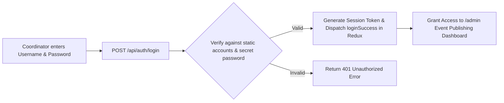

# Unit 5: Event Creation & Coordinator Authentication (Problem $\to$ Solution)

## 1. Problem Statement 1: Dynamic Event Creation
### The Problem:
In our initial React app, the list of fest events was hardcoded in `mockData.js`. If the CSE department decided to add a new "AI Prompt Battle" or the ECE department increased seat limits from 30 to 50, a developer had to edit source code and re-deploy the entire application.

### The Solution:
We implemented the **Coordinator Event Creation Portal** (`/admin` and `POST /api/events`):
1. Controlled Form capturing event metadata (`title`, `department`, `category`, `rules`, `venue`, `fees`, `prize`, `seats`).
2. Server-side validation verifying required fields.
3. Database insertion in MySQL / in-memory store.
4. Immediate re-validation so the new event appears live in the catalog without re-deploying.

---

## 2. Problem Statement 2: The Need for Authentication & Static Password Guard
### The Problem:
If the `/admin` event creation URL is public, any student attendee could create spam events, change prize pools, or disrupt the symposium schedule. We need an authentication barrier so that **only authorized faculty coordinators and student leads** can publish events.

### The Solution:
We implemented **Coordinator Authentication** using Redux Toolkit and a backend authentication endpoint with static password verification:



### Static Credentials for Workshop Practice:
- **Username**: `admin` (or `cse_coordinator`, `ece_coordinator`)
- **Password**: `kiotfest2026`

---

## 3. Code Architecture

### A. Backend Route (`pages/api/auth/login.js`)
```javascript
export default async function handler(req, res) {
  const { username, password } = req.body;
  
  if (username === 'admin' && password === 'kiotfest2026') {
    return res.status(200).json({
      success: true,
      token: `kiot_session_${Date.now()}`,
      coordinator: { username: 'admin', name: 'Dr. S. Karthi', department: 'CSE' }
    });
  }
  
  return res.status(401).json({ error: 'Invalid coordinator credentials.' });
}
```

### B. Client-Side Route Protection (`pages/admin.js`)
```javascript
export default function AdminPage() {
  const isAuthenticated = useSelector(selectIsAuthenticated);

  if (!isAuthenticated) {
    return (
      <div className="text-center py-20">
        <h2>🔒 Coordinator Portal Locked</h2>
        <Link href="/login?redirect=/admin">Sign In as Coordinator</Link>
      </div>
    );
  }

  return <EventCreationForm />;
}
```
