# Unit 5: Next.js Rendering Strategies Explained for 3rd Year Students

## 1. Client-Side Rendering (CSR) vs Static Generation (SSG) vs Server-Side Rendering (SSR)

```mermaid
graph TD
    subgraph CSR - Traditional React SPA
        A1[Browser requests page] --> A2[Server sends blank HTML root div]
        A2 --> A3[Browser downloads heavy JS bundle]
        A3 --> A4[React boots up and renders content]
    end

    subgraph SSG - Static Site Generation
        B1[Built once at build time npm run build] --> B2[Pre-rendered HTML saved on CDN]
        B2 --> B3[Browser gets instant complete HTML]
    end

    subgraph SSR - Server-Side Rendering
        C1[Browser requests page] --> C2[Next.js Server queries MySQL DB on each request]
        C2 --> C3[Server sends freshly rendered HTML + data]
    end
```



---

## 2. When to Use Which in KIOT Fest?

| Feature in KIOT Fest | Recommended Strategy | Next.js Function / Pattern | Why? |
| :--- | :--- | :--- | :--- |
| **Fest Rules, Guidelines & FAQ** | **SSG** (Static Generation) | `getStaticProps` | Fest rules rarely change. SSG serves instant static HTML from CDN with 0ms database latency. |
| **Individual Event Detail Pages** | **SSG + ISR** | `getStaticProps` + `getStaticPaths` (`revalidate: 60`) | Pre-builds all 20 event pages at build time; regenerates in background if coordinator edits details. |
| **Live Seat Counter & Real-Time Dashboard** | **SSR** (Server-Side) or **API Route** | `getServerSideProps` or `/api/events` | Seats are booked in real-time. Students need live, accurate seat availability on every refresh. |
| **Student Registration Pass (`/my-tickets`)** | **Client-Side + API** | `useEffect` / Redux + `/api/my-tickets` | Personalized to student's roll number stored in browser / session. |

---

## 3. Code Examples for Students

### A. Static Site Generation (`getStaticProps` in Next.js)
```javascript
// pages/events/[id].js
import { getEventById, getAllEventIds } from '../../lib/mockData';

export async function getStaticPaths() {
  const ids = getAllEventIds();
  const paths = ids.map(id => ({ params: { id: id.toString() } }));
  return { paths, fallback: 'blocking' };
}

export async function getStaticProps({ params }) {
  const event = await getEventById(params.id);
  if (!event) {
    return { notFound: true };
  }
  return {
    props: { event },
    revalidate: 60 // Incremental Static Regeneration every 60s
  };
}

export default function EventDetailPage({ event }) {
  return (
    <div className="max-w-4xl mx-auto p-6">
      <h1 className="text-3xl font-bold text-white">{event.title}</h1>
      <p className="text-slate-400 mt-2">{event.description}</p>
      {/* Event Details */}
    </div>
  );
}
```

### B. Server-Side Rendering (`getServerSideProps` in Next.js)
```javascript
// pages/live-status.js
import { getLiveSeatAvailability } from '../lib/db';

export async function getServerSideProps() {
  const liveStats = await getLiveSeatAvailability();
  return {
    props: { liveStats, fetchedAt: new Date().toLocaleTimeString() }
  };
}

export default function LiveStatusPage({ liveStats, fetchedAt }) {
  return (
    <div className="p-6">
      <h2 className="text-2xl font-bold">Live Seat Dashboard (Fetched at {fetchedAt})</h2>
      {/* Real-time stats */}
    </div>
  );
}
```
